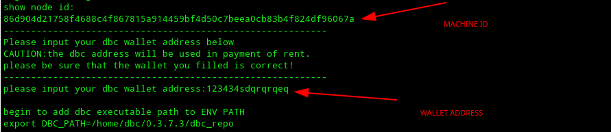

#                        DBC算力节点部署

## 一、安装前准备(基于已配置好固定公网ip地址），部署KVM安装环境

### 注意：系统采用ubuntu18.04 LTS或者20.04LTS,，并在开始前请卸载掉已经安装的显卡驱动，本操作不可带有显卡驱动

```shell
sudo apt-get update
sudo apt-get upgrade -y
sudo apt-get  install qemu-kvm libvirt-clients libvirt-daemon-system bridge-utils virt-manager ovmf cpu-checker vim -y
```

## 二、创建和挂载XFS文件系统

### 1、查看硬盘分区情况

`lsblk`

### 2、创建数据盘文件夹并且格式化硬盘、挂载硬盘(数据盘挂载目录务必为/data)

```shell
sudo mkdir /data
sudo apt-get install xfsprogs -y
sudo mkfs.xfs -n ftype=1 -f /dev/sdb  （此处是否为sdb需要根据lsblk查看情况而定）
sudo mount  -o pquota /dev/sdb /data
sudo chmod 777 /data
sudo echo "/dev/sdb /data     xfs pquota 0 1" >> /etc/fstab
sudo mount -a
```

## 三、判断机器是否支持虚拟化

### 1、开启硬件支持

> BIOS开启VT-d（根据主板类型浏览器搜索即可）
> VT（VT-x）及VT-d支持，需要将相关支持设置为enable，默认开启
>
> 一般情况下路径：Processor—IIO Configuration—Intel@ VT for Directed I/O(VT-d)

### 2、环境依赖，检查CPU是否支持虚拟化以及KVM是否可用

`egrep -c '(svm|vm)' /proc/cpuinfo`

> CPU检测，如果显示为0，则不支持虚拟化

`kvm-ok`

> 检查kvm是否可用
>
> 显示INFO: /dev/kvm exists  
> KVM acceleration can be used
> 表示可以进行后续操作，如果显示与其不相符，请检查VT-d是否正确开启

***如果您是20.04系统，操作以下内容即可，无需再去操作其他关于vfio-pci步骤，如果您是ubuntu18.04系统，请按照第四步开始操作***
```shell
#查询显卡ID
lspci -nnv | grep NVIDIA
复制显卡id，例如10de:2231  10de:1aef，重复内容仅保留一次即可

#修改内核文件
sudo vim /etc/default/grub
#在GRUB_CMDLINE_LINUX_DEFAULT字段添加 
quiet splash intel_iommu=on kvm.ignore_msrs=1 vfio-pci.ids=<显卡id，中间以逗号隔开>

#更新内核
sudo update-grub

#重启机器
#查询显卡占用情况
lspci -vv -s <显卡PCI接口> | grep driver
(显示vfio-pci即为正常，非vfio-pci请返回查看grub文件是否写对）
```
***20.04LTS系统显卡隔离步骤到此结束，请前往步骤7继续操作***


## 四、启用系统分组

### 1、配置intel_iommu

```shell
sudo vim /etc/default/grub

#在GRUB_CMDLINE_LINUX_DEFAULT字段添加 
intel_iommu=on iommu=pt rd.driver.pre=vfio-pci
#在GRUB_CMDLINE_LINUX字段添加 
intel_iommu=on iommu=pt rd.driver.pre=vfio-pci
```

### 2、配置模块文件

```shell
sudo vim  /etc/modules
#添加以下内容：
pci_stub
vfio
vfio_iommu_type1
vfio_pci
kvm
kvm_intel

#更新grub.cfg文件
sudo update-grub

#重启机器，检查iommu有没有正确启用（也可后续操作完一起重启检查）
dmesg | grep -i iommu

#显示类似于[ 3.887539] pci 0000:83:00.1: Adding to iommu group 46即表明成功启用
```

## 五、隔离GPU资源

### 1、设置黑名单，使卡不被占用

```shell
sudo vim /etc/modprobe.d/blacklist.conf  
#最后添加内容：
blacklist snd_hda_intel
blacklist amd76x_edac
blacklist vga16fb
blacklist nouveau
blacklist rivafb
blacklist nvidiafb
blacklist rivatv
```

### 2、收集PCI设备信息

```shell
lspci -nnv | grep NVIDIA
#显示类似于
17:00.0 VGA compatible controller [0300]: NVIDIA Corporation TU104 [GeForce RTX 2080] [10de:1e82] (rev a1) (prog-if 00 [VGA controller])
17:00.1 Audio device [0403]: NVIDIA Corporation TU104 HD Audio Controller [10de:10f8] (rev a1)
17:00.2 USB controller [0c03]: NVIDIA Corporation TU104 USB 3.1 Host Controller [10de:1ad8] (rev a1) (prog-if 30 [XHCI])
17:00.3 Serial bus controller [0c80]: NVIDIA Corporation TU104 USB Type-C UCSI Controller [10de:1ad9] (rev a1)
65:00.0 VGA compatible controller [0300]: NVIDIA Corporation TU104 [GeForce RTX 2080] [10de:1e82] (rev a1) (prog-if 00 [VGA controller])
65:00.1 Audio device [0403]: NVIDIA Corporation TU104 HD Audio Controller [10de:10f8] (rev a1)
65:00.2 USB controller [0c03]: NVIDIA Corporation TU104 USB 3.1 Host Controller [10de:1ad8] (rev a1) (prog-if 30 [XHCI])
65:00.3 Serial bus controller [0c80]: NVIDIA Corporation TU104 USB Type-C UCSI Controller [10de:1ad9] (rev a1)

>>>>>>>>>>>>>>>>>>>>>>>>>>>>>>>>>>>>>>>>>>>>>>>>>>>>>>>>>>>>>>>>>>>>>>>>>>>>>>>>>>
#记录所有的设备编码以及PCI的id(重复编码仅取一次）
#例如：
#设备编码：
10de:1e82,10de:10f8,10de:1ad8,10de:1ad9    （重复仅记录一次即可）
#PCI接口id（每台机器PCI接口不一样，请注意记录）
17:00.0
17:00.1
17:00.2
17:00.3
65:00.0
65:00.1
65:00.2
65:00.3
```

### 3、设置vfio并隔离用于直通的GPU

```shell
sudo vim /etc/modprobe.d/vfio.conf
#写入上面收集到的设备编码信息（若重复，只写一次即可）：
options vfio-pci ids=10de:1e82,10de:10f8,10de:1ad8,10de:1ad9

sudo vim /etc/modules-load.d/vfio-pci.conf
#写入以下内容
vfio-pci kvmgt vfio-iommu-type1 vfio-mdev

#重启机器
sudo reboot
```

### 4、查看GPU状态(所有接口都要查询，防止出现未被vfio-pci占用)

```shell
#请注意PCI接口内容替换！
lspci -vv -s <PCI接口> | grep driver
#例如：
lspci -vv -s 17:00.0 | grep driver
lspci -vv -s 17:00.1 | grep driver
lspci -vv -s 17:00.2 | grep driver
lspci -vv -s 17:00.3 | grep driver

#没有输出说明没有驱动.
#如果有显示Kernel driver in use: vfio-pci 说明隔离成功
#如果是显示类似于Kernel driver in user: snd_hda_intel说明设备被其他驱动占用 
```

> **如果有PCI未被vfio-pci占用，请继续往下执行，如果已经成功被vfio-pci占用，可跳过下一步**。


## 六、如果驱动查询为Kernel driver in use: vfio-pci，无需操作以下内容，未成功绑定请继续执行

### 1、解绑设备

> 如果驱动查询显示非Kernel driver in user: vfio-pci，将设备解绑（每组id都要解绑，以下仅为示例，请根据自身查询pci接口修改）

```shell
#请注意内容的替换，下面的命令仅作演示(需解绑所有被占用的显卡pci接口)
sudo -i
sudo echo 0000:17:00.0 > /sys/bus/pci/devices/0000\:17\:00.0/driver/unbind
sudo echo 0000:83:00.0 > /sys/bus/pci/devices/0000\:83\:00.0/driver/unbind


sudo modprobe vfio
sudo modprobe vfio-pci
sudo reboot

#重新启动主机并检查GPU是否在不同的IOMMU组中隔离，以及正在使用vfio驱动程序
#执行命令检查GPU是否在不同的IOMMU组中隔离
find /sys/kernel/iommu_groups/*/devices/*
#显示分组即为正常

#重新查询PCI（注意替换），若仍未查询到vfio-pci或显示其他内容，请执行一下一步
lspci -vv -s 17:00.0 | grep driver
```

### 2、手动绑定GPU

```shell
#执行命令进行绑定(注意：echo后的内容为机器查询到的显卡id）已经被占用的PCI可不用再手动绑定
sudo -i
sudo echo 10de 1e82 > /sys/bus/pci/drivers/vfio-pci/new_id
sudo echo 10de 2206 >> /sys/bus/pci/drivers/vfio-pci/new_id
…………


#绑定完成后再次查询（每张卡的所有项都要查一下）
lspci -vv -s 17:00.0 | grep driver
#如果出现 Kernel driver in use : vfio-pci 说明绑定成功。如果仍未成功，请返回检查
```


## 七、确认机器显卡被vfio-pci占用后，启动libvirtd服务并设置开机自启(这一步配置非常重要）

### 1、开启virt tcp监听服务：

```shell
修改配置文件：
sudo vim /etc/libvirt/libvirtd.conf

找到下边这2行，去掉开头的#号：
#listen_tls = 0
#listen_tcp = 1

找到这一行，去掉开头#号，并且将sasl改为none：
#auth_tcp = "sasl"	======>	auth_tcp = "none"

sudo vim /etc/default/libvirtd
#对应修改为如下配置（这个是小写L）
libvirtd_opts="-l"

对于ubuntu 20.04，需要执行下边这一步：
systemctl mask libvirtd.socket libvirtd-ro.socket libvirtd-admin.socket libvirtd-tls.socket libvirtd-tcp.socket
```

### 2、启动libvirtd并设置开机自启&检查服务状态

+ sudo systemctl restart libvirtd.service
+ sudo systemctl enable libvirtd.service
+ systemctl status libvirtd

### 3、测试libvirtd是否启动成功
+ virsh connect qemu+tcp://localhost:16509/system
+ 如果没有输出错误，就说明启动成功了；


## 八、创建dbc用户

```shell
sudo wget http://116.85.24.172:20444/static/add_dbc_user.sh
sudo chmod +x add_dbc_user.sh
sudo ./add_dbc_user.sh dbc
#dbc用户密码自行设定
```


## 九、安装DBC节点程序

> 注意：需要切换到dbc用户安装

```shell
su - dbc
sudo mkdir install && cd install
sudo wget http://111.44.254.179:22244/install_dbc_ry_machine.sh
sudo bash ./install_dbc_ry_machine.sh -d
sudo bash ./install_dbc_ry_machine.sh -i /home/dbc
```

>  输入您的资金账户钱包地址（如果机器被租用，该钱包地址涉及dbc质押与收益的流动，请确保地址信息正确）
> 


## 十、重启DBC程序&服务状态检查

```shell
sudo systemctl stop dbc
sudo systemctl start dbc
sudo systemctl status dbc
```


## 十一、下载镜像模板（请放置于/data目录下，dbc启动虚拟机会去/data目录搜寻）

http://111.44.254.179:22244/ubuntu-img/
备用网站：http://111.44.254.164:22244/ubuntu-img/


## 十二、备份机器id以及私钥(非常重要)

> 备份如下文件内容：vi  /home/dbc/0.3.7.3/dbc_repo/dat/node.dat，放到安全的位置，后面如果重装系统或者重装DBC需要用到


## 十三、个人钱包地址查看

`cat /home/dbc/0.3.7.3/dbc_repo/conf/core.conf`


## 十四、参数检查（暂时忽略，正在重新修改，程序包内暂时去掉了）

```shell
#检查内存、硬盘、显卡、IP，如果在网站上没有看到下图的内容，说明系统没有检测到内存或者硬盘，需要手动执行一次检查命令：
sudo bash   /home/dbc/0.3.7.3/dbc_repo/tool/node_info/node_info.sh

# 重启DBC：
sudo systemctl restart dbc
```

> 执行完成此步骤检查参数获取是否正常
>
> cat /home/dbc/0.3.7.3/dbc_repo/.dbc_node_info.conf
>
> 如果GPU部分显示为N/A ，可以忽略。其他部分显示N/A或空，请手动改正后重启DBC


## 十五、查看机器是否正确加入到算力网络
+ 使用官方提供客户端节点查看
+ 矿池搭建客户端节点
+ 以上两点详见：https://github.com/DeepBrainChain/DBC-DOC/blob/master/DBC_install/%E6%90%AD%E5%BB%BADBC%E5%AE%A2%E6%88%B7%E7%AB%AF%E8%8A%82%E7%82%B9.md
+ 关于客户端节点：建议每家矿池搭建2个及以上客户端节点，保证在官方提供节点或者其他矿池提供节点掉线情况下依旧可以保证网络正常，如果网络中客户端节点过少或者挂掉过多，会影响机器出租情况。客户端节点搭建可以在其他服务器启动一个容器来部署，并不会占用太多资源。
## 十六、机器上链

https://github.com/DeepBrainChain/DBC-DOC/blob/master/chain_ops/bonding_machine.md#%E6%9C%BA%E5%99%A8%E4%B8%8A%E7%BA%BF%E6%AD%A5%E9%AA%A4
