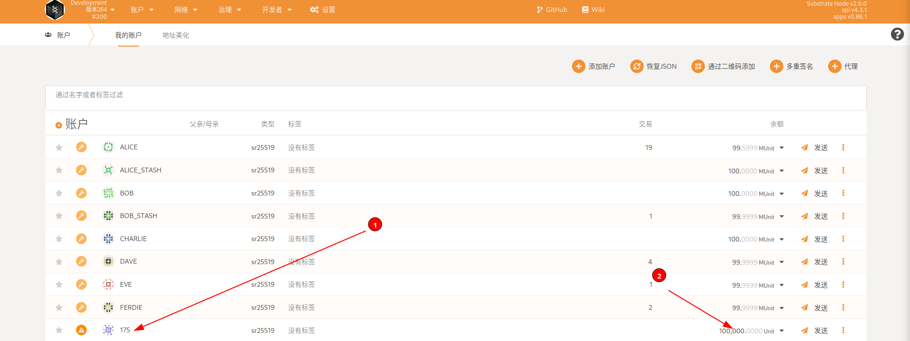
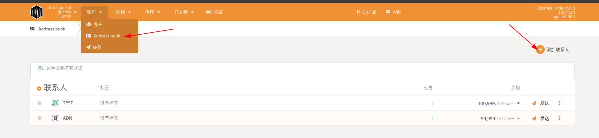
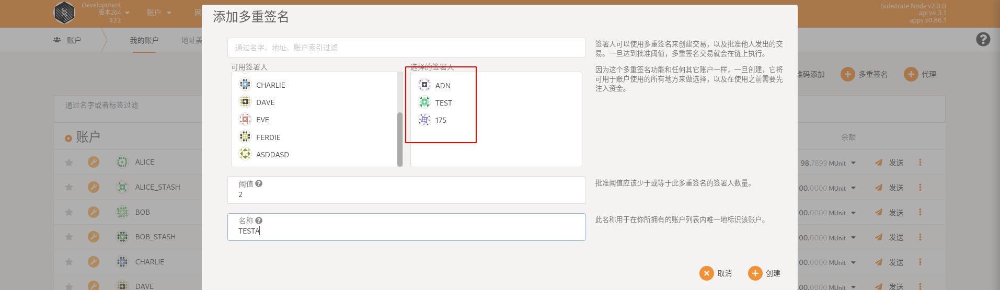
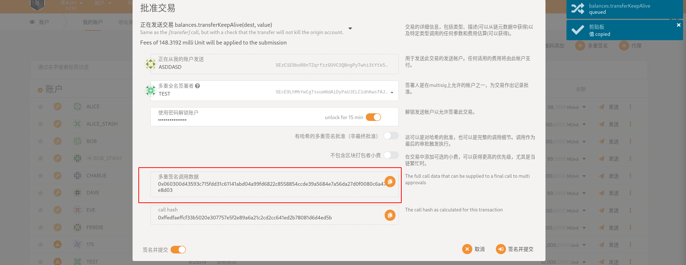
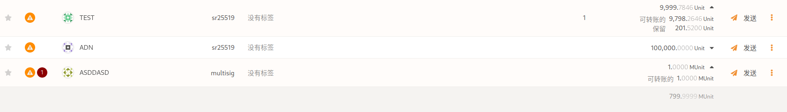
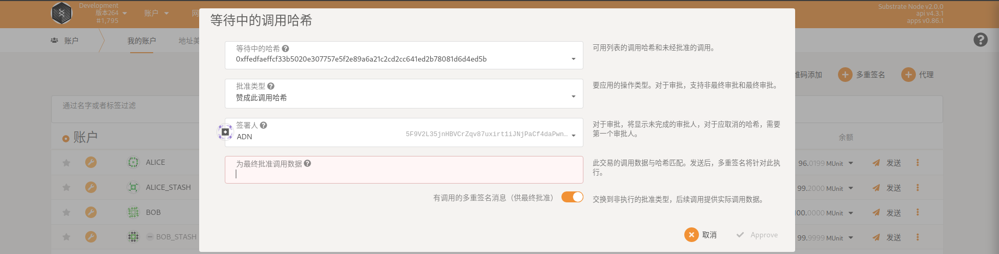
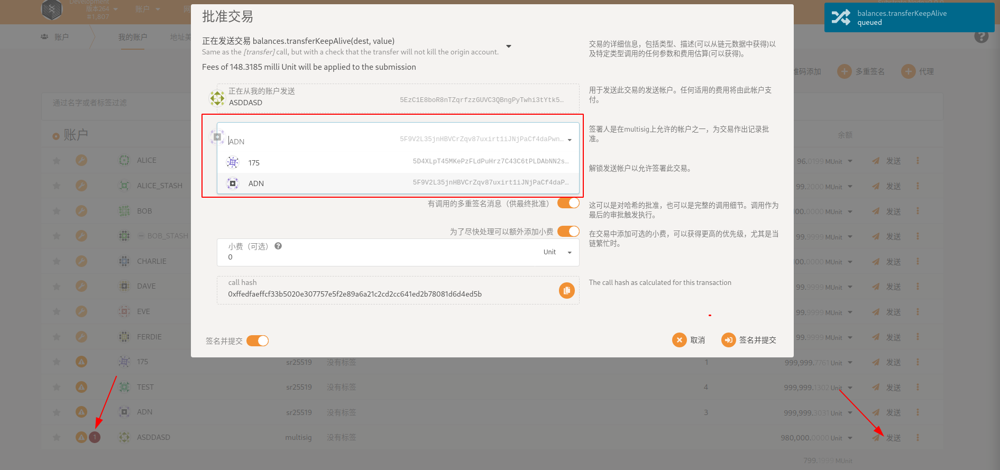

# 多重签名账户

## 什么是多重签名账户

+ 可以在基于 Substrate 的链中创建多签名帐户。一个多签名账户由一个或多个地址和一个阈值组成。阈值定义了需要多少签名者（参与地址）同意提交外部信息才能使调用成功。
+ 例如，Alice、Bob 和 Charlie 设置了一个阈值为 2 的多重签名。这意味着即使 Charlie 不同意，Alice 和 Bob 也可以执行任何调用。同样，Charlie 和Bob可以在没有Alice的情况下执行任何调用。阈值通常是一个小于成员总数的数字，但也可以等于它，这意味着他们都必须达成一致。

## 多重签名账户的用途

- 保护您的财产安全：使用额外的签署人作为 2FA 机制来保护您的资金。一个签名者可以在一台计算机上，另一个可以在另一台计算机上，或者在冷存储中。这会减慢您与链的交互，但安全性高几个数量级。
- 董事会决策：企业和基金会等法律实体使用多重签名来共同管理实体的财务。
- 团体参与治理：多重签名账户可以做普通账户可以做的一切。多重签名帐户可以是 Kusama 治理中的理事会成员，其中一组社区成员可以作为一个实体进行投票。

+ 注意：多重签名账户**创建后不可修改**。更改成员集或更改阈值是不可能的，而是需要解散当前的多重签名并创建一个新的多重签名。因此，多重签名帐户地址是**确定性的**，即您始终可以通过知道成员和阈值来计算多重签名的地址，而帐户尚不存在。这意味着可以将令牌发送到尚不存在的地址，如果指定为接收者的实体在匹配阈值下以新的多重签名聚集在一起，他们将立即可以访问这些令牌。

## 如何生成多重签名账户地址

### 以测试网为例

**要创建多重签名地址并使用它发送交易，您需要以下内容：**

- 多重签名成员的地址列表。我们将使用 TEST、ADN 和 175。
- DBC存入多重签名地址。
- 多签账户以及成员账户都需要有DBC，来支付交易过程中产生的可退还押金以及手续费。

1.您应该已经拥有自己的帐户，里面有一些硬币。

2.要生成多重签名地址，我们需要**将多重签名成员地址添加到**“帐户 > Address book”下的通讯录中。对于每个地址，单击右上角的“添加联系人”并提供地址和姓名

3.**接下来，我们需要创建新的多重签名地址。**导航到帐户页面（从工具栏，“帐户> 帐户”）并单击“+ 多重签名”按钮。我们将通讯录内两个账户和自己的账户三个组为多签账户，阈值为“2”。（阈值要小于等于成员账户数量建议2/3   3/5等组合）单击创建，即可发现账户中多了一个多签账户，并为其转一些币。

4.**要发送交易，我们需要其中一个成员来发起它。以 TEST 来发起交易演示。

确保TEST有足够的硬币来支付多重签名交易存款和交易费用。然后，点击“多签账户”下的“发送”，选择目的地址（我们在本地生成地址）和转账金额，点击“进行交易”。批准交易中产生的多重签名调用数据要复制出来，发送给多签账户中其他人，进行交易验证

5.您现在将看到“多重签名测试地址”（红色的“1”图标）的待处理交易，如果您单击TEST余额下的下拉菜单，您将看到相当于多重签名存款的值已被“保留”，呈现在多重签名交易完成之前，该值不可转让。

6.**接下来，我们需要第二个签名。**让我们从ADN那里得到它。在 ADN 的浏览器中，从上述步骤重复以下操作。

6.1. 将175、TEST和多重签名交易目标地址添加到 ADN 的地址簿。
6.2. 使用相同的参数（ADN、TEST和 175 的地址，阈值为“2”）创建一个新的多重签名地址。

> 注意：由于多重签名地址的生成是确定性的，如果 Bob（或任何其他成员）在他的计算机上使用 Alice、Charlie 和他的地址生成一个多重签名地址，阈值为“2”，他将生成**相同的**Alice 在这里拥有的多重签名地址。

如果操作正确，我们应该会看到ADN的浏览器中生成了**相同的**多重签名地址，并且还显示了一个待处理的交易。

接下来，为了获得ADN的签名，他需要通过提供相同的目标地址和转账金额（以及交易参数）、签名和提交来制作与 TEST所做的相同的多重签名交易。TEST 通过上传交易哈希和哈希的签名来发起交易。这些交易参数将允许AND生成并签署 TEST 之前签署的相同交易（相同的哈希）。

>即：如果不使用多重签名调用数据来验证通过交易的。可以使用另外一个账户作为交易发起人，向同一个收款账户发送同样多的币，也视为通过此次交易，你可以看到以下两种操作方式

+ 这一个是需要填写我们第一位发起交易时产生的多重签名调用数据，并点击签名提交通过

+ 这一个是我们没有收到多重签名调用数据，三个人都知道给目标账户转准确数额DBC时，可以采用点击`发送`---->`输入与第一个发起人同等数量的DBC`并签名提交即可通过此次交易。
