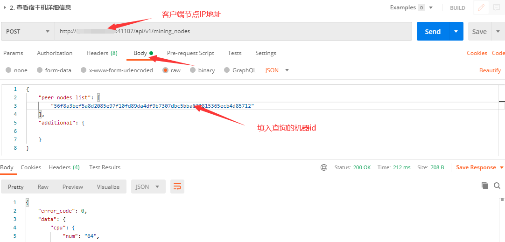

# 搭建DBC客户端节点

## 1. 客户端节点的作用

+ DBC客户端节点在整个网络当中作为信任人的身份，可以查询到当前网络中的正确部署功能节点的机器。当功能节点部署完成后，可以通过http请求客户端节点来查看您的功能节点是否成功连接到客户端节点。当通过客户端请求能成功看到您的功能节点机器ID时，这代表您已经成功部署完成功能节点。
+ 建议：由于官方提供的客户端节点也并不能永久保持稳定在线，所以，建议每家矿池搭建两个客户端节点以作备用，同时也可以壮大DBC网络。
+ 提示：客户端节点对硬件设备要求很低，可以正常运行的公网服务器都可以搭建，占用内存非常小，只要可以通过公网访问即可。

## 2.安装客户端节点

```shell
sudo wget http://116.85.24.172:20444/static/dbc/dbc-linux-client-0.3.7.3.tar.gz
sudo tar -zxvf dbc-linux-client-0.3.7.3.tar.gz
cd 0.3.7.3/dbc_repo/


#修改conf目录下的core.conf配置文件：
rest_ip 改为0.0.0.0

#启动dbc：
./dbc -d
```

## 3.查看客户端节点是否正确部署

+ 查看端口是否正确开放 `ss -unltp | grep 41107` 被dbc占用即为成功。
+ 执行`ps -ef | grep dbc`,有显示`./dbc -d`即可。

## 4.通过HTTP请求查看功能节点是否正确加入到网络（通过浏览器访问）

+ 安装postman客户端
+ 导入以下地址json查询
+ http://111.44.254.179:22244/tmp_api.postman_collection.json
+ 操作方法：将以上json内容或文件保存下来，然后打开postman选择file-----import导入，然后添加搭建的客户端ip地址即可
+ 查询所有机器不需要加任何参数即可使用，查机器id详细信息选择post请求链接下方的***body***，peer_nodes_list下输入机器id发送即可查询

