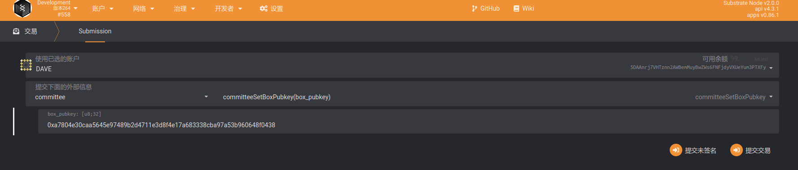
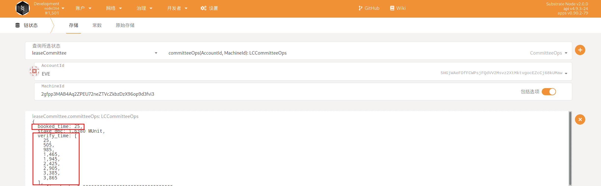
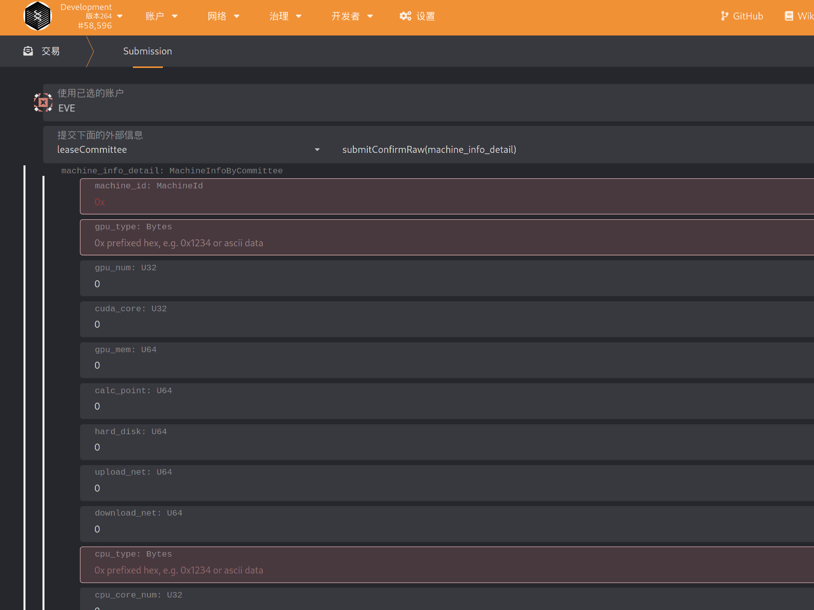

# 委员会如何验证机器

打开网页钱包的设置页面：https://www.dbcwallet.io/?rpc=wss%3A%2F%2Fpreinfo.dbcwallet.io#/settings/developer （初次打开会提示类型报错，这个是正常现象，把下面的types.json填入到设置-》开发者页面中就正常了）


打开https://github.com/DeepBrainChain/DeepBrainChain-MainChain/blob/alpha-v2.1/dbc_types.json ，复制 types.json的内容，并粘贴到网页钱包的设置-》开发者页面中，点击保存。

刷新网页，等待一会。页面打开后 点击账户-》添加账户就可以创建钱包 （助记词务必要保存好，建议在多个地方备份，这个丢失了里面的dbc代币将无法找回，永久丢失）

0. 成为验证委员会成员

    可以通过社区投票参加委员会。（银河竞赛公测阶段，加微信号：DBCService，发送钱包地址和微信名，进行统计）

    验证委员会成员需要提交用于信息加密的公钥，才能正常的派单与抢单。

    ```bash
    # 自行安装node.js v14
    git clone https://github.com/DeepBrainChain/DeepBrainChain-MainChain.git && cd DeepBrainChain-MainChain && git checkout alpha-v2.1
    cd scripts/test_script/ && npm install
    
    
    # 生成公钥，需要利用脚本，指定自己的私钥
    node gen_boxpubkey.js --key "0x868020ae0687dda7d57565093a69090211449845a7e11453612800b663307246"
    ```

    生成了公钥之后，到`committee` -- `committeeSetBoxPubkey` 提交交易进行设定。

    

1. 查看系统分配给自己的订单。导航到 `开发者`--`链状态`--`存储`，在其中选择`leaseCommittee`模块的`committeeMachine`存储，点击右侧的`+`号，可以看到委员会的订单情况。如果所示，该委员会有一个系统分配的订单

   

2. 查看系统分配给该委员会进行验证的时间区间：导航到 `开发者`--`链存储`--`存储`，选择`leaseCommittee`的`committeeOps`方法，并输入自己的委员会帐号，与上一步委派的机器 ID，可以查询到类似下面的信息：

   

   其中，booked_time 表示派单时间，注意，派单之后的 36~48 小时(也就是区块高度 booked_time + 4320 ~ booked_time + 5760)之间，委员会提交原始信息。

   `verify_time` 表示系统分派的，委员会验证机器信息的开始时间。如图，该委员会被分派了 9 次机会来验证机器，每次持续时间为 4 个小时，也就是 480 个块高。此时，委员会可以挑选自己方便的时间，通过前端查询该机器的登录信息，登录到系统中验证机器。

3. 查询机器信息
   
   下载安装postman，具体下载请去官网根据操作系统安装

   下载josn文件：http://111.44.254.179:22244/tmp_api.postman_collection.json
   
   导入json文件：fiel----import----选择json文件导入 import
    
    
   查看宿主机详细信息：
   
   签名工具下载地址：https://github.com/DeepBrainChain/DBC-AIComputingNet/releases/download/0.3.7.3/sign_tool
   
   签名执行：./sign_tool 钱包地址 钱包私钥
   

   在下图中填入：sign、nonce、wallet （注意：sign、nonce只能使用一次），可以查询到机器信息
   

   

5. 委员会计算获得机器信息的 hash

   我们已经提供了脚本来计算需要填写的信息的 Hash：

   `https://github.com/DeepBrainChain/DeepBrainChain-MainChain/blob/alpha-v2.1/scripts/hash_machine_info.py`

   当获取到要求的信息后，修改该脚本，并执行，得到 hash 值。**请保存好所填写的信息，直到该机器上线成功，或者上线失败**

   ```bash
   python3 hash_machine_info.py
   ```

4. 委员会提交机器信息的 Hash。如图，在 36 小时之前提交机器信息的 Hash(提交的时候要注意 0x一定不能去掉)

   注意：图片中，**leaseCommittee替换成onlineCommittee!!!** 其他不变。
   
   
   
5. 委员会提交机器的原始信息。**请确保提交机器原始信息时，在派单之后的 36~48 小时之间！**

   
