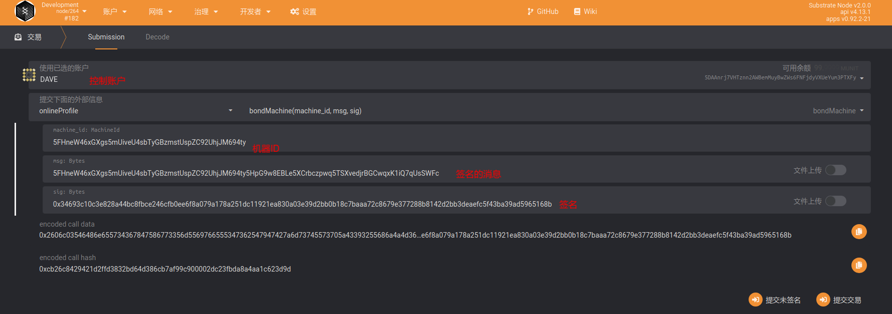
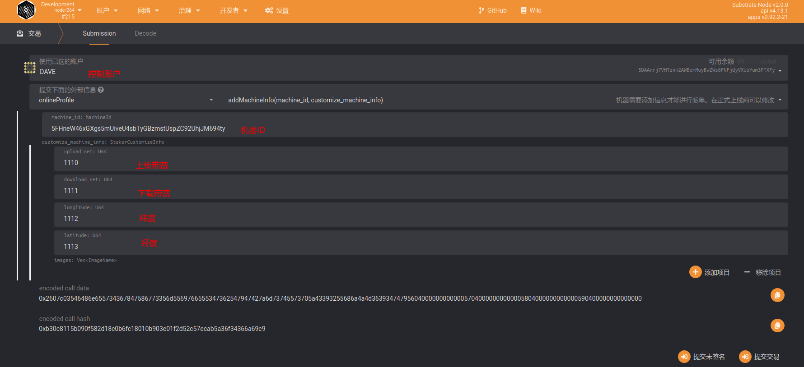

# 机器上链步骤

## 方式 1: 通过网页钱包绑定

### 0. 准备工作

+ 绑定之前，请确保钱包中有足够的余额。（预计每张卡按 10 万 DBC）。
+ 打开网页钱包的设置页面：`https://www.dbcwallet.io/?rpc=wss%3A%2F%2Finnertest.dbcwallet.io#/settings/developer`

+ 打开`https://github.com/DeepBrainChain/DeepBrainChain-MainChain/blob/feature/staking_v3.0.0_online_profile/types.json` ，复制 `types.json`的内容，并粘贴到网页钱包的设置页面，点击保存。

  

+ 刷新网页，等待一会。

### 1. 资金账户绑定控制账户

+ 说明：

  + 为了您的账户资金安全，我们强烈建议使用多签账户作为资金账户，关于多签账户，请转到https://github.com/DeepBrainChain/DBC-DOC/blob/master/DBC_install/%E5%A4%9A%E9%87%8D%E7%AD%BE%E5%90%8D%E8%B4%A6%E6%88%B7.md 了解
  +  资金账户为机器中内置的，绑定机器时将从资金账户质押DBC，分发奖励时将发放到资金账户。
  + 控制账户为管理人员，负责机器上机，维护等操作
  + 资金账户必须指定一个控制账户。
  + 控制账户要有少量的DBC，链上操作产生的手续费会从控制账户扣除。

+ 导航到：`开发者`--`交易`，如下图选择`onlineProfile`模块的`setController`方法，分别选择资金账户和控制账户，点击右下角绑定

  

  如图，BOB_STASH 账户(资金账户) 将 DAVE账户设置为了控制账户。

  BOB_STASH: 5HpG9w8EBLe5XCrbczpwq5TSXvedjrBGCwqxK1iQ7qUsSWFc

  DAVE: 5DAAnrj7VHTznn2AWBemMuyBwZWs6FNFjdyVXUeYum3PTXFy
### 2. 机器生成签名消息

> 需要使用机器私钥生成签名消息，发送到链上，以确认内置的资金账户。
>
> 注意：由于DBC程序目前还没有将机器ID更新为类钱包形式，此次测试机器ID可以采用`创建一个新的账户`，**用账户钱包地址作为机器id进行模拟测试**，或者执行以下操作生成机器ID：

#### 生成机器ID

```
sudo wget http://111.44.254.179:22244/subkey
sudo chmod +x subkey
./subkey generate --scheme sr25519
```

例如，我们通过上述步骤，生成了机器的账户

```
机器账户: 5FHneW46xGXgs5mUiveU4sbTyGBzmstUspZC92UhjJM694ty
机器私钥: 0x398f0c28f98885e046333d4a41c19cee4c37368a9832c6502f6cfd182e2aef89
```

#### 使用机器私钥生成签名数据

使用下面的[脚本](https://github.com/DeepBrainChain/DeepBrainChain-MainChain/blob/feature/staking_v3.0.0_online_profile/scripts/test_script/gen_signature.js)生成签名数据。其中，`--msg` 指定需要签名的消息，内容为 `机器账户+资金账户`；`--key` 指定机器的私钥；`Signature:`后面生成的数据即为签名数据。

```bash
❯ node gen_signature.js --key 0x398f0c28f98885e046333d4a41c19cee4c37368a9832c6502f6cfd182e2aef89 --msg 5FHneW46xGXgs5mUiveU4sbTyGBzmstUspZC92UhjJM694ty5HpG9w8EBLe5XCrbczpwq5TSXvedjrBGCwqxK1iQ7qUsSWFc
### MSG: 5FHneW46xGXgs5mUiveU4sbTyGBzmstUspZC92UhjJM694ty5HpG9w8EBLe5XCrbczpwq5TSXvedjrBGCwqxK1iQ7qUsSWFc
### SignedBy: 5FHneW46xGXgs5mUiveU4sbTyGBzmstUspZC92UhjJM694ty
### Signature: 0x34693c10c3e828a44bc8fbce246cfb0ee6f8a079a178a251dc11921ea830a03e39d2bb0b18c7baaa72c8679e377288b8142d2bb3deaefc5f43ba39ad5965168b
```

#### 使用控制账户`上线机器`

现在，我们可以通过控制账户，把上一步骤产生的签名消息广播出去，进行机器上链的操作。

导航到：`开发者`--`交易`，如下图选择`onlineProfile`模块的`bondMachine`方法。使用控制账户，将`MachineId`与控制账户进行绑定即可。



#### 控制账户添加机器信息

控制账户还需要补充机器信息：



### 3. 查询与领取奖励

#### 1. 查询奖励

在开发者--链状态中选择：`onlineProfile`模块的`stashMachines`方法，参数填入**stash**账户（不是控制账户 ），你将能查到该stash账户获得奖励的详细信息。

其中，`can_claim_reward`为能够领取的奖励，`left_reard`为之前每天获得奖励的剩余部分（剩下的75%，这75%将在随后的150天线性释放）。


#### 2. 领取奖励

使用**控制账户**领取即可，奖励将发放到stash账户。


## 方式 2: 通过脚本添加

TODO

```bash
git clone https://github.com/DeepBrainChain/DeepBrainChain-MainChain.git
cd DeepBrainChain-MainChain && git checkout feature/staking_v3.0.0_online_profile && cd scripts/test_script
yarn

ws="wss://innertest.dbcwallet.io"
tf="../../dbc_types.json"
rpc="../../dbc_rpc.json"
bob_stash_key="0x1a7d114100653850c65edecda8a9b2b4dd65d900edef8e70b1a6ecdcda967056"
bob="5FHneW46xGXgs5mUiveU4sbTyGBzmstUspZC92UhjJM694ty"
dave="5DAAnrj7VHTznn2AWBemMuyBwZWs6FNFjdyVXUeYum3PTXFy"
dave_key="0x868020ae0687dda7d57565093a69090211449845a7e11453612800b663307246"

# stash账户设置控制账户.控制账户为：Dave; 该机器ID为Bob; 机器stash账户为BobStash:
node tx_by_user.js --port $ws --type-file $tf --rpc-file $rpc --module onlineProfile --func setController \
    --key $bob_stash_key $dave

# 绑定机器: dave为控制人，绑定了一个机器：Bob, 受益账户为BobStash
node tx_by_user.js --port $ws --type-file $tf --rpc-file $rpc --module onlineProfile --func bondMachine \
    --key $dave_key $bob
```
