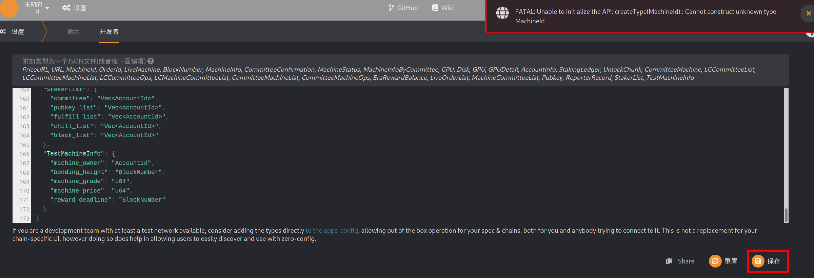

# 机器上链步骤

## 方式 1: 通过网页钱包绑定

### 0. 准备工作

+ 绑定之前，请确保钱包中有足够的余额。（预计每张卡按 10 万 DBC）。
+ 打开网页钱包的设置页面：`https://www.dbcwallet.io/?rpc=wss%3A%2F%2Finfotest.dbcwallet.io#/settings/developer` （打开会提示报错，这个是正常现象，这个时候根据下面步骤来继续操作）

+ 打开`https://github.com/DeepBrainChain/DeepBrainChain-MainChain/blob/alpha-v2.0-fix/dbc_types.json` ，复制 `types.json`的内容，并粘贴到网页钱包的设置页面，点击保存。

  

+ 刷新网页，等待一会。

### 1. 资金账户绑定控制账户

+ 说明：

  + 为了您的账户资金安全，我们强烈建议使用多签账户作为资金账户，关于多签账户，请转到https://github.com/DeepBrainChain/DBC-DOC/blob/master/DBC_install/%E5%A4%9A%E9%87%8D%E7%AD%BE%E5%90%8D%E8%B4%A6%E6%88%B7.md 了解
  +  `资金账户` 绑定机器时将从`资金账户`质押DBC，分发奖励时将发放到`资金账户`。
  + `控制账户`为管理人员，负责机器上机，维护等操作
  + `资金账户`必须指定一个`控制账户`。
  + `控制账户`要有一些的DBC，链上操作产生的手续费会从`控制账户`扣除。

+ 导航到：`开发者`--`交易`，如下图选择`onlineProfile`模块的`setController`方法，分别选择`资金账户`和`控制账户`，点击右下角绑定

  

  > 如上图，BOB_STASH 账户(`资金账户`) 将 DAVE账户设置为了`控制账户`。
  >
  > `资金账户`: `5HpG9w8EBLe5XCrbczpwq5TSXvedjrBGCwqxK1iQ7qUsSWFc`
  >
  > `控制账户`: `5DAAnrj7VHTznn2AWBemMuyBwZWs6FNFjdyVXUeYum3PTXFy`
  
+ **查询资金账户与控制账户是否绑定成功**：如下图，当资金账户绑定成功控制账户后，可以通过`开发者`--`链状态`，选择`onlineProfile`模块的`controllerStash`存储，来查询`控制账户`对应的资金账户。下图，查询到了一个控制账户对应的资金账户。

  
### 2. 机器生成签名消息

> 需要使用机器私钥生成签名消息，发送到链上，以确认内置的资金账户。

#### 查询`机器ID`和`机器私钥`

```shell
# 机器ID和私钥在dbc安装程序的目录下，如：
# /home/dbc/0.3.7.3/dbc_repo/dat/node.dat
# 其内容为：
node_id=8eaf04151687736326c9fea17e25fc5287613693c912909cb226aa4794f26a48			# 机器ID
node_private_key=398f0c28f98885e046333d4a41c19cee4c37368a9832c6502f6cfd182e2aef89	# 机器私钥
```

#### 使用`机器私钥`生成签名数据

使用下面的[脚本](https://github.com/DeepBrainChain/DeepBrainChain-MainChain/blob/feature/staking_v3.0.0_online_profile/scripts/test_script/gen_signature.js)生成签名数据。
```shell
#使用方法
1.在linux服务器安装nodejs 14（版本一定要是14，不然会有其他报错，安装方法请自行百度）
2.克隆脚本： git clone https://github.com/DeepBrainChain/DeepBrainChain-MainChain.git -b feature/staking_v3.0.0_online_profile
3.安装：cd DeepBrainChain-MainChain/scripts/test_script && npm install
4.执行脚本
```

其中，`--msg` 指定需要签名的消息，消息内容为 `机器ID+资金账户`；`--key` 指定`机器私钥`, **key前面加上0x**；

`Signature:`后的数据即为**签名数据**。

```bash
❯ node gen_signature.js --key 0x398f0c28f98885e046333d4a41c19cee4c37368a9832c6502f6cfd182e2aef89 --msg 8eaf04151687736326c9fea17e25fc5287613693c912909cb226aa4794f26a485CiPPseXPECbkjWCa6MnjNokrgYjMqmKndv2rSnekmSK2DjL
### Message: 8eaf04151687736326c9fea17e25fc5287613693c912909cb226aa4794f26a485CiPPseXPECbkjWCa6MnjNokrgYjMqmKndv2rSnekmSK2DjL
### Signer: 8eaf04151687736326c9fea17e25fc5287613693c912909cb226aa4794f26a48
### Signature: 0x5cc8b4c49b244d7c071b124ef68119d7549dd805ea43f69e3c142fd5909f926041a9cad93b16085d72431df2d1164e7911085423bca16625295583686f2fce8c
```

#### 使用`控制账户`上线机器

现在，我们需要通过`控制账户`，把上一步骤产生的***签名数据***广播出去。

导航到：`开发者`--`交易`，如下图选择`onlineProfile`模块的`bondMachine`方法。使用`控制账户`，将`机器ID`(`MachineId`)与`控制账户`进行绑定即可。参数填写如下图：


#### 查询机器是否绑定成功：

  完成这一步后，可以通过`开发者`--`链状态`--`onlineProfile`--`liveMachines`查询系统中的机器。如下图，查询到一台机器已被绑定。接下来需要补充机器信息

  

#### `控制账户`添加机器信息

`控制账户`还需要补充机器信息：

导航到：开发者--交易，如下图选择`onlineProfile`模块的`addMachineInfo`方法。参数填写如下图：


+ 参数说明：（TODO）
  + upload_net: 上传带宽（以20M带宽为例，填入20）。
  + download_net: 下载带宽（以20M带宽为例，填入20）。
  + longitude: 经度。东经为正，西经为负（以东经131.1548123为例，填入1311548，注意经度和纬度不要填反了,误差30公里，此处填错了会被扣质押币）。
  + latitude:  纬度。北纬为正，南纬为负（以南纬121.143253为例，填入-1211432，注意经度和纬度不要填反了,误差30公里，此处填错了会被扣质押币）。
  + 机房网络信息，可以根据情况，从以下几种中选择：（中国移动：China Mobile ， 中国联通：China Unicom ， 中国电信： China Telecom ， 海外运营商根据实际名称填写，此处填错了会被扣质押币）
  + 镜像信息，从以下几种中选择：（ubuntu ， ubuntu-proofs）

### 3.查询机器链上状态信息
+ 导航到`开发者`----`链状态`----`onlineprofile`----`machinesInfo(MachineId): MachineInfo`
  + 如果想查询单台机器在`MachineId`处填入机器id即可查询对应信息
  + 如果想查询多台机器信息可以采用上方单台查询方案也可以关闭机器ID后面的***包括选项***，然后点击 + 进行查询，筛查

### 4. 查询与领取奖励

#### 1. 查询奖励

在开发者--链状态中选择：`onlineProfile`模块的`stashMachines`方法，参数填入**`资金账户`**，你将能查到该`资金账户`获得奖励的详细信息。

其中，`can_claim_reward`为能够领取的奖励，`left_reard`为之前每天获得奖励的剩余部分（剩下的75%，这75%将在随后的150天线性释放）。


#### 2. 领取奖励

使用**控制账户**领取即可，奖励将发放到**`资金账户`**。


## 方式 2: 通过脚本添加

TODO

```bash
git clone https://github.com/DeepBrainChain/DeepBrainChain-MainChain.git
cd DeepBrainChain-MainChain && git checkout feature/staking_v3.0.0_online_profile && cd scripts/test_script
yarn

ws="wss://innertest.dbcwallet.io"
tf="../../dbc_types.json"
rpc="../../dbc_rpc.json"
bob_stash_key="0x1a7d114100653850c65edecda8a9b2b4dd65d900edef8e70b1a6ecdcda967056"
bob="5FHneW46xGXgs5mUiveU4sbTyGBzmstUspZC92UhjJM694ty"
dave="5DAAnrj7VHTznn2AWBemMuyBwZWs6FNFjdyVXUeYum3PTXFy"
dave_key="0x868020ae0687dda7d57565093a69090211449845a7e11453612800b663307246"

# stash账户设置控制账户.控制账户为：Dave; 该机器ID为Bob; 机器stash账户为BobStash:
node tx_by_user.js --port $ws --type-file $tf --rpc-file $rpc --module onlineProfile --func setController \
    --key $bob_stash_key $dave

# 绑定机器: dave为控制人，绑定了一个机器：Bob, 受益账户为BobStash
node tx_by_user.js --port $ws --type-file $tf --rpc-file $rpc --module onlineProfile --func bondMachine \
    --key $dave_key $bob
```


## 查询账户绑定的机器
+ 查看资金账户下上链的机器
 + 导航到`开发者`----`链状态`----`存储`----`onlineProfile`----`stashMachines`
+ 查看控制账户下上链的机器
 + 导航到`开发者`----`链状态`----`存储`----`onlineProfile`----`controllerMachines`

## 机器下线与重新上线
+ 机器下线
  + 导航到`开发者`----`交易`----`onlineprofile`----`controllerReportOffline`----`输入机器id`----`提交交易`
  + 注意，发起者需要是控制账户

+ 机器重新上线
  + 导航到`开发者`----`交易`----`onlineprofile`----`controllerReportOnline`----`输入机器id`----`提交交易`
> 机器重新上线时还需重新提交机器信息，请确保经纬度信息正确。
