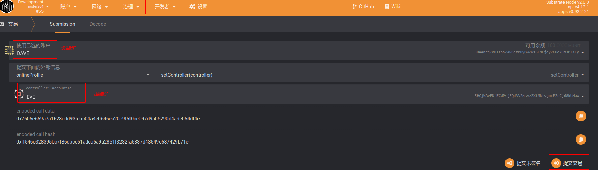
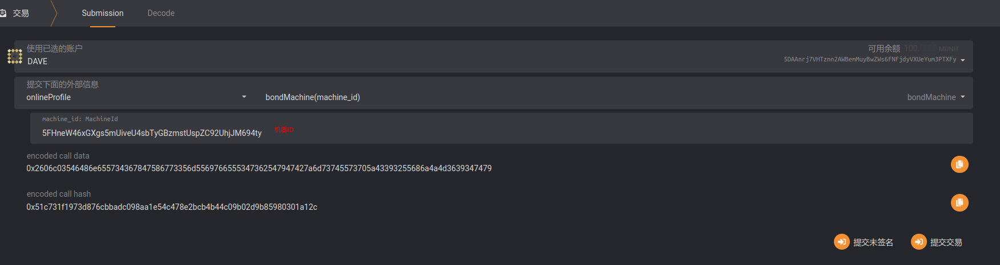
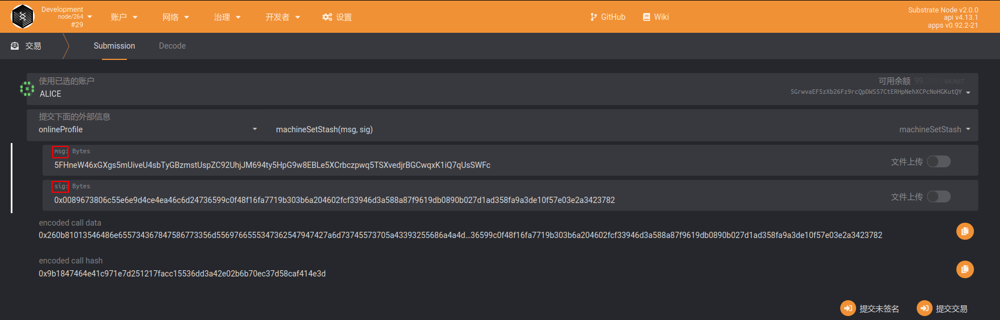

# 机器上链步骤

## 方式 1: 通过网页钱包绑定

### 0. 准备工作

+ 绑定之前，请确保钱包中有足够的余额。（预计每张卡按 10 万 DBC）。
+ 打开网页钱包的设置页面：`https://www.dbcwallet.io/?rpc=wss%3A%2F%2Finnertest.dbcwallet.io#/settings/developer`

+ 打开`https://github.com/DeepBrainChain/DeepBrainChain-MainChain/blob/feature/staking_v3.0.0_online_profile/types.json` ，复制 `types.json`的内容，并粘贴到网页钱包的设置页面，点击保存。

  

+ 刷新网页，等待一会。

### 1. 资金账户绑定控制账户

+ 说明：

  +  资金账户为机器中内置的，绑定机器时将从资金账户质押DBC，分发奖励时将发放到资金账户。
  + 控制账户为管理人员，负责机器上机，维护等操作
  + 资金账户必须指定一个控制账户。
  + 控制账户要有少量的DBC，链上操作产生的手续费会从控制账户扣除。

+ 导航到：`开发者`--`交易`，如下图选择`onlineProfile`模块的`setController`方法，分别选择资金账户和控制账户，点击右下角绑定

  
  
### 2. 上线机器

​	导航到：`开发者`--`交易`，如下图选择`onlineProfile`模块的`bondMachine`方法。使用控制账户，将MachineId与控制账户进行绑定即可。



### 3. 机器生成签名信息

> 注意：由于DBC程序目前还没有将机器ID更新为类钱包形式，此次测试机器ID对应私钥请去/home/dbc/0.3.7.3/dbc_repo/dat/node.dat的node_private_key=取

+ 例如，

  + 机器ID为`5FHneW46xGXgs5mUiveU4sbTyGBzmstUspZC92UhjJM694ty`
  + 机器ID对应的私钥为: `0x398f0c28f98885e046333d4a41c19cee4c37368a9832c6502f6cfd182e2aef89`
  + 资金账户为`5HpG9w8EBLe5XCrbczpwq5TSXvedjrBGCwqxK1iQ7qUsSWFc`

  则生成签名的方法为（未来将提供网页工具）：

  ```bash
  # 注意：请自行安装node.js v14 和 yarn
  git clone https://github.com/DeepBrainChain/DeepBrainChain-MainChain.git
  cd DeepBrainChain-MainChain && git checkout feature/staking_v3.0.0_online_profile && cd scripts/test_script
  yarn
  
  node gen_signature.js --key 0x398f0c28f98885e046333d4a41c19cee4c37368a9832c6502f6cfd182e2aef89 --msg "5FHneW46xGXgs5mUiveU4sbTyGBzmstUspZC92UhjJM694ty5HpG9w8EBLe5XCrbczpwq5TSXvedjrBGCwqxK1iQ7qUsSWFc"
  ```

生成结果：

```
### MSG: 5FHneW46xGXgs5mUiveU4sbTyGBzmstUspZC92UhjJM694ty5HpG9w8EBLe5XCrbczpwq5TSXvedjrBGCwqxK1iQ7qUsSWFc
### SignedBy: 5FHneW46xGXgs5mUiveU4sbTyGBzmstUspZC92UhjJM694ty
### Signature: 0xa2dac9014f46b2190aefcac4ede674fdfff06564f7644dd8fa96d9748e3a53329fc5c028651a756e5e287927ea0d20fafb3fa8264dd8be46108b26a387915182
```

其中，Signature即为签名信息

### 4. 机器提交签名信息，绑定资金账户

+ 说明：我们需要机器签名以确认机器对应的资金账户

+ 导航到：`开发者`--`交易`，如下图选择`onlineProfile`模块的`machineSetStash`方法，填入参数，提交交易即可。

+ 其中，msg参数，填写 [机器IDStash账户] 拼接而成的字符串；sig 参数填写通过机器私钥对字符串签名的结果。

  


### 5. 查询与领取奖励

#### 1. 查询奖励

在开发者--链状态中选择：`onlineProfile`模块的`stashMachines`方法，参数填入**stash**账户（不是控制账户 ），你将能查到该stash账户获得奖励的详细信息。

其中，`can_claim_reward`为能够领取的奖励，`left_reard`为之前每天获得奖励的剩余部分（剩下的75%，这75%将在随后的150天线性释放）。


#### 2. 领取奖励

使用**控制账户**领取即可，奖励将发放到stash账户。


## 方式 2: 通过脚本添加

```bash
git clone https://github.com/DeepBrainChain/DeepBrainChain-MainChain.git
cd DeepBrainChain-MainChain && git checkout feature/staking_v3.0.0_online_profile && cd scripts/test_script
yarn

ws="wss://innertest.dbcwallet.io"
tf="../../dbc_types.json"
rpc="../../dbc_rpc.json"
bob_stash_key="0x1a7d114100653850c65edecda8a9b2b4dd65d900edef8e70b1a6ecdcda967056"
bob="5FHneW46xGXgs5mUiveU4sbTyGBzmstUspZC92UhjJM694ty"
dave="5DAAnrj7VHTznn2AWBemMuyBwZWs6FNFjdyVXUeYum3PTXFy"
dave_key="0x868020ae0687dda7d57565093a69090211449845a7e11453612800b663307246"

# stash账户设置控制账户.控制账户为：Dave; 该机器ID为Bob; 机器stash账户为BobStash:
node tx_by_user.js --port $ws --type-file $tf --rpc-file $rpc --module onlineProfile --func setController \
    --key $bob_stash_key $dave

# 绑定机器: dave为控制人，绑定了一个机器：Bob, 受益账户为BobStash
node tx_by_user.js --port $ws --type-file $tf --rpc-file $rpc --module onlineProfile --func bondMachine \
    --key $dave_key $bob
```
