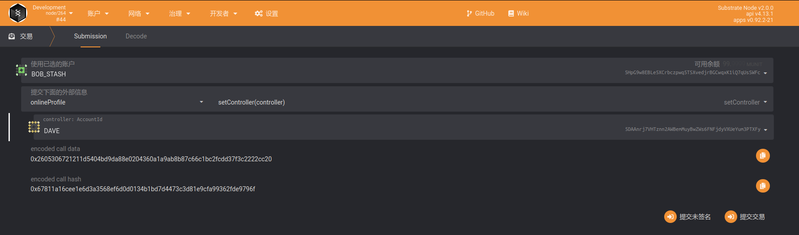
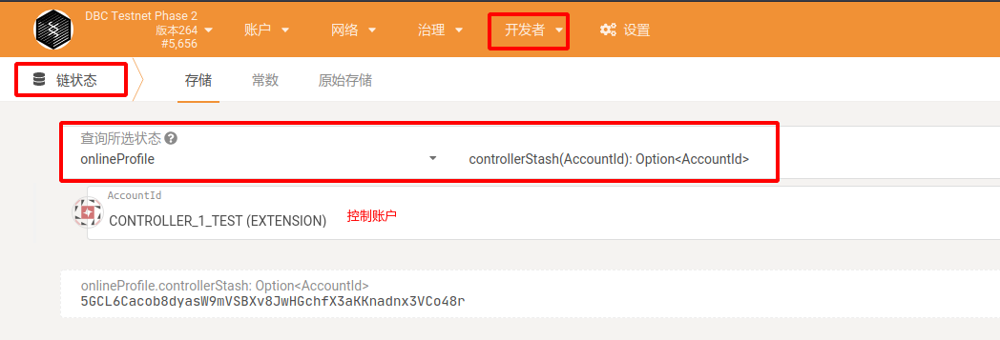
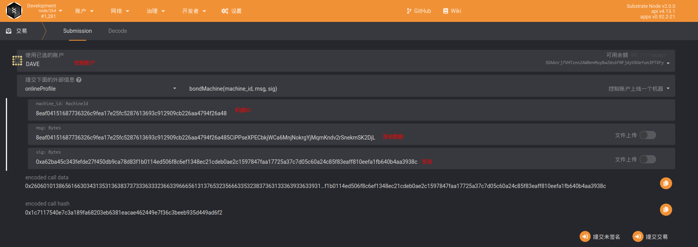
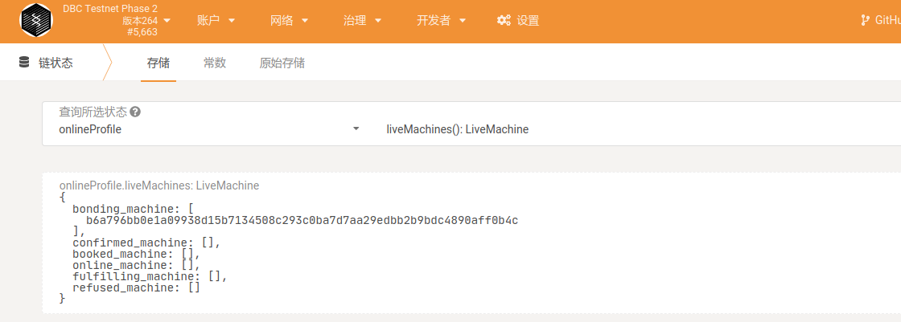
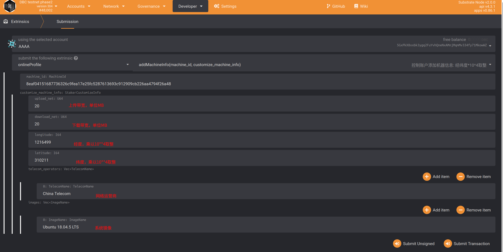
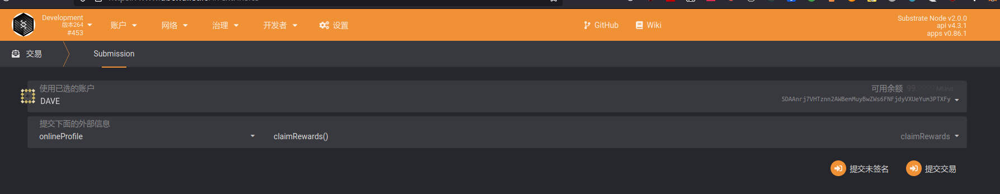
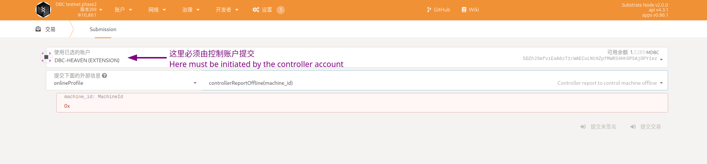

# Machine Onchain steps

## Method 1: Binding via web wallet

### 0. Ready to work

- Before binding, please make sure you have enough balance in your wallet. (Each card is estimated to be 100,000 DBC).

  > DBC-Mainnet is launched, Please go to https://www.dbcwallet.io/?rpc=wss%3A%2F%2Finfo.dbcwallet.io#/explorer to make machine onchain!
  > The following steps in browser should be done in DBC-Mainnet

### 1. Stash account binding control account

- Description：

  - For the safety of your account funds, we strongly recommend using a multi-signature account as a capital account. For multi-signature accounts, please go to https://github.com/DeepBrainChain/DBC-DOC/blob/master/DBC_install/%E5%A4%9A%E9%87%8D%E7%AD%BE%E5%90%8D%E8%B4%A6%E6%88%B7.md
  - The `Stash Account` is built into the machine. When the machine is bound, the DBC will be pledged from the `Stash Account`, and when the rewards are distributed, it will be issued to the `Stash Account`.
  - `Control account` is the manager, responsible for the operation of the machine, maintenance, etc.
  - `Stash account` must specify a `control account`.
  - The `control account` requires some DBC, and the handling fee generated by the operation on the chain will be deducted from the `control account`.

- Navigate to: `Developer`--`Transaction`, as shown below, select the `setController` method of the `onlineProfile` module, select your `stash account` and `control account` respectively, and click bind in the lower right corner

  

  > As shown above, BOB_STASH account (`Stash account`) set DAVE account as `control account`.
  >
  > `Stash Account`: `5HpG9w8EBLe5XCrbczpwq5TSXvedjrBGCwqxK1iQ7qUsSWFc`
  >
  > `Control account`: `5DAAnrj7VHTznn2AWBemMuyBwZWs6FNFjdyVXUeYum3PTXFy`

- Query whether the capital account and the control account are successfully bound\*\*: as shown in the figure below, when the capital account is successfully bound to the control account, you can select `controllerStash` of the `onlineProfile` module through `Developer`--`Chain Status` Store, to query the fund account corresponding to the `control account`. In the figure below, a fund account corresponding to a control account is queried.

  

### 2. The machine generates a signed message

> You need to use the machine's private key to generate a signed message and send it to the chain to confirm the built-in fund account.

- Query `Machine ID` and `Machine Private Key``

```shell
# The machine ID and private key are in the directory of the dbc installation program, such as:
# /home/dbc/0.3.7.3/dbc_repo/dat/node.dat
# Its content is:
node_id=8eaf04151687736326c9fea17e25fc5287613693c912909cb226aa4794f26a48 # Machine ID
node_private_key=398f0c28f98885e046333d4a41c19cee4c37368a9832c6502f6cfd182e2aef89 # Machine private key
```

- Use `machine private key` to generate signature data

Use the following [script](https://github.com/DeepBrainChain/DeepBrainChain-MainChain/blob/master/scripts/test_script/gen_signature.js) to generate signature data.

```shell
#Instructions
1. Install nodejs 14 on the linux server (the version must be 14, otherwise there will be other errors, please Google for the installation method)
2. Clone script: git clone https://github.com/DeepBrainChain/DeepBrainChain-MainChain.git
3. Installation: cd DeepBrainChain-MainChain/scripts/test_script && npm install
4. Execute the script
```

Among them, `--msg` specifies the message that needs to be signed, and the message content is `machine ID+fund account`; `--key` specifies `machine private key`, and **key is prefixed with 0x**;

The data after `Signature:` is the **signature data**.

```bash
❯ node gen_signature.js --key 0x398f0c28f98885e046333d4a41c19cee4c37368a9832c6502f6cfd182e2aef89 --msg 8eaf04151687736326c9fea17e25fc5287613693c912909cb226aa4794f26a485CiPPseXPECbkjWCa6MnjNokrgYjMqmKndv2rSnekmSK2DjL

### Message: 8eaf04151687736326c9fea17e25fc5287613693c912909cb226aa4794f26a485CiPPseXPECbkjWCa6MnjNokrgYjMqmKndv2rSnekmSK2DjL
### Signer: 8eaf04151687736326c9fea17e25fc5287613693c912909cb226aa4794f26a48
### Signature: 0x5cc8b4c49b244d7c071b124ef68119d7549dd805ea43f69e3c142fd5909f926041a9cad93b16085d72431df2d1164e7911085423bca16625295583686f2fce8c
```

#### Use `Control Account` to go online

Now, we need to broadcast the **_signature data_** generated in the previous step through the `control account`.

Navigate to: `Developer`--`Transaction`, and select the `bondMachine` method of the `onlineProfile` module as shown below. Use `Control Account` to bind `Machine ID` (`MachineId`) with `Control Account`. Fill in the parameters as shown below:

#### Query whether the machine is successfully bound:

After completing this step, you can query the machines in the system through `Developer`--`Chain Status`--`onlineProfile`--`liveMachines`. As shown in the figure below, a machine is queried that has been bound. Next, you need to add machine information

- 

#### `Control account` add machine information

`Control account` also needs to add machine information:Navigate to `Developer` -- `Transaction`--`onlineProfile`--`addMachineInfo`



- Parameter description:
  - upload_net: upload bandwidth (take 20MB bandwidth as an example, fill in 20).
  - download_net: download bandwidth (take 20MB bandwidth as an example, fill in 20).
  - longitude:Longitude. The east longitude is positive and the west longitude is negative (take the east longitude 131.1548123 as an example, fill in 1311548,Be careful not to fill in the longitude and latitude upside down.The error can be within the range of 30 km, and the pledge will be deducted if the content is wrong).
  - latitude: Latitude. North latitude is positive and south latitude is negative (take south latitude 121.143253 as an example, fill in -1211432,Be careful not to fill in the longitude and latitude upside down.The error can be within the range of 30 km, and the pledge will be deducted if the content is wrong).
  - Computer room network information, you can choose from the following according to the situation: (China Mobile: China Mobile, China Unicom: China Unicom, China Telecom: China Telecom, non-Chinese operators fill in according to their actual names.The pledge will be deducted if the content is wrong)
  - Mirror information, choose from the following: (ubuntu, ubuntu-proofs)

### 3. Check and receive rewards

#### 1. Check rewards

In the developer-chain status, select: the `stashMachines` method of the `onlineProfile` module, fill in the parameters in **`fund account`**, you will be able to find the detailed information of the reward for the `fund account`.

Among them, `can_claim_reward` is the reward that can be claimed, and `left_reard` is the remaining part of the reward obtained every day before (the remaining 75%, this 75% will be released in the subsequent 150 antennas).


#### 2. Collect rewards

Use **Control Account** to receive it, and rewards will be issued to **`Stash Account`**.



## Query the machine bound to the account

- View the machines on the chain under the fund account
  - Navigate to `Developer`----`Chain Status`----`Storage`----`onlineProfile`----`stashMachines`
- View the machines on the chain under the control account
  - Navigate to `Developer`----`Chain Status`----`Storage`----`onlineProfile`----`controllerMachines`

## Machine offline and back online

- Machine offline
  - Navigate to `Developer`----`Transaction`----`onlineprofile`----`controllerReportOffline`----`Enter machine id`----`Submit transaction`
  - Note that the initiator needs to be a controlling account
    
- Modify machine information
  - Navigate to `Developer`----`Transaction`----`onlineprofile`----`addMachineInfo`
- The machine is back online
  - Navigate to `Developer`----`Transaction`----`onlineprofile`----`controllerReportOnline`----`Enter machine id`----`Submit transaction`
