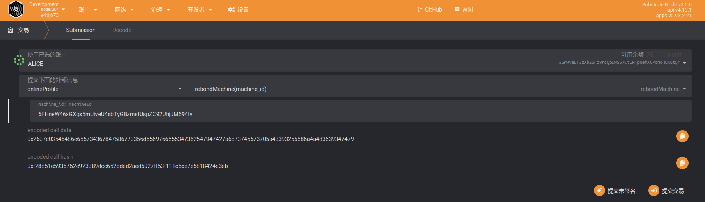
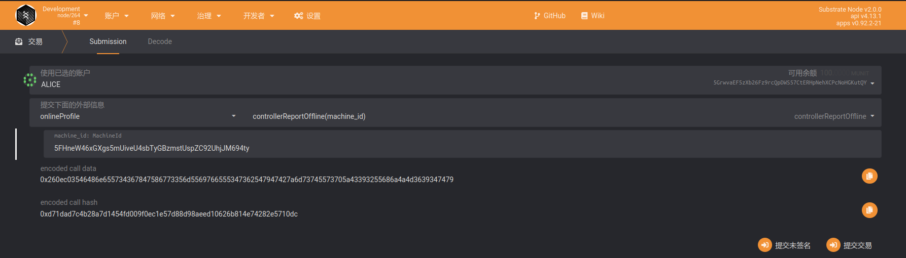
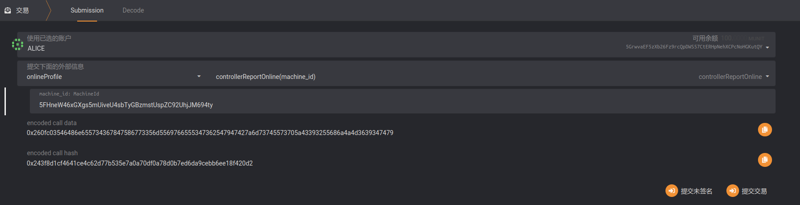
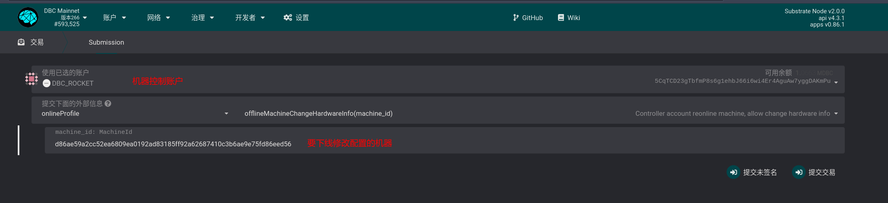

# TODO

### 补充质押

> 机器第一次绑定时，质押绑定一张卡所需要的 DBC，当机器被委员会审核通过后，系统将根据委员会提交的信息（GPU 数）检查并增加卡数对应的质押。
>
> 此时，当质押不够时，机器 ID 将被放到`online_profile模块`--`live_machine`变量的`fulfilling_machine`字段中，表示需要**补充质押**，才能上线。

补充质押的操作：

### 重新绑定

> 当机器被委员会拒绝后，有 10 天的时间可以声明重新绑定。

### 因故障声明机器下线

> 当机器出现故障时，为了避免被举报，机器维护者需要及时声明**机器下线**，来及时处理机器问题。

操作：`onlineProfile` -- `controllerReportOffline`

### （因故障声明下线后）声明机器上线

> 当机器从故障中恢复后，需要及时声明机器上线。

操作：`onlineProfile`--`controllerReportOnline`

### 下线修改机器配置（将会被重新进行验证）

操作： onlineProfile -- offlineMachineChangeHardwareInfo

然后执行： onlineProfile -- addMachineInfo 重新添加机器信息之后，将会被重新分配进行验证
