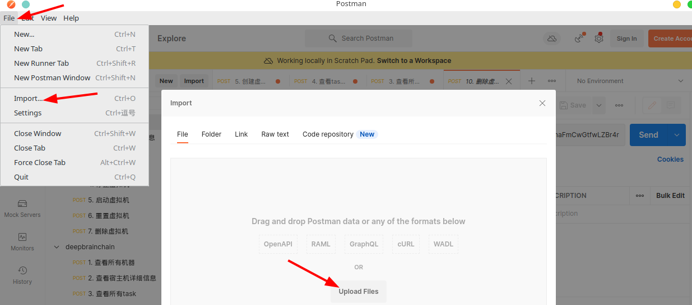
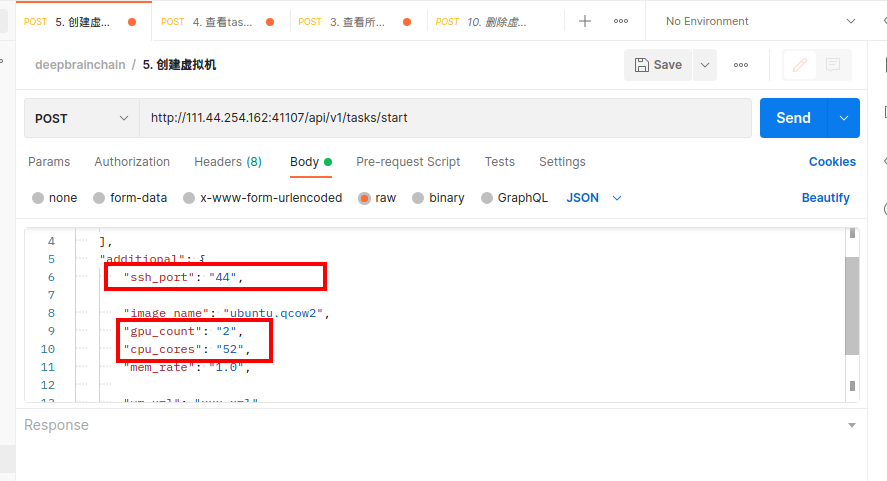
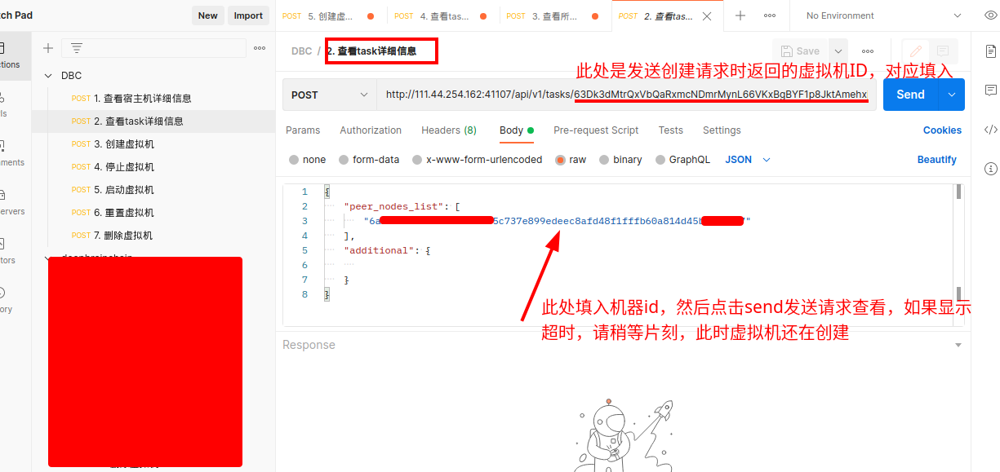

# 链上机器租用
## 租用流程

### 步骤一
+ 打开浏览器https://www.dbcwallet.io/?rpc=wss%3A%2F%2Finnertest.dbcwallet.io#/extrinsics （打开会提示报错，这个是正常现象，这个时候根据下面步骤来继续操作）
+ 添加类型：`设置`----`开发者`，复制粘贴以下json内容https://github.com/DeepBrainChain/DeepBrainChain-MainChain/blob/alpha-v2.0-fix/dbc_types.json
+ 创建钱包：账户--》添加账户 （助记词一定要保存好，丢失了助记词，账户就无法找回，币就丢失掉了）
+ 到https://galaxyrace.deepbrainchain.org/table找到对应类型的空闲机器

### 步骤二
+ 租用链上机器(发邮件申请测试币：feng@deepbrainchain.org,邮件主题：申请测试币，邮件内容：钱包地址)
  + 导航到`开发者`----`交易`----`rentMachine`----`rentMachine(machine_id, duration)`
   + machine_id输入要租用的机器id，输入框里面的0x要先删除掉
   + duration输入需要租用的天数
   + 输入完成后点击提交交易，并在三十分钟内确认机器是否可用。（如果30分钟内不确认租用，支付的dbc会退回，但是交易手续费10 dbc是无法退回的）

### 步骤三：创建虚拟机
+ post发送请求创建虚拟机
  + 下载安装postman，具体下载请去官网根据操作系统安装
  + 下载josn文件：http://111.44.254.179:22244/DBC.postman_collection.json
  + 导入json文件：`fiel`----`import`----`选择json文件导入`
  
  
  
  + 查看宿主机详细信息：
  
  
  
  + 创建虚拟机：选择创建虚拟机请求模块，`body`处填入：`peer_nodes_list`:机器id；`ssh_port`:定义ssh登录端口；`image_name`：填入ubuntu.qcow2即可，`GPU_count`：根据机器实际GPU数量填入；`CPU_cores`：选择提供给虚拟机的CPU内核数，（本操作属于宿主机CPU直通虚拟机，建议留给宿主机三个及以上保证机器稳定运行，（虚拟机内核数最好为偶数），否则导致整个机器卡死，无法正常使用）；`mem_rate`：填入1.0即可
  
  
  
+ 创建过程比较慢，大约在五分钟到十五分钟之间，在postman的查看task详细信息查看虚拟机登录信息,创建完成后请及时到链上确认租用（从付款起只有三十分钟）

+ 虚拟机状态查看，查看task详细信息，返回的结果中"status": "creating"表示虚拟机正在创建，此时等待即可
+ 其他虚拟机相关操作与上述操作相类似，请结合实际使用。

### 步骤四： 确认机器可用并租赁 （确认之前必须要确认虚拟机能够正常启动，否则这一步确认过后，表示机器租用成功，DBC是无法退回的）
  + 导航到`开发者`----`交易`----`rentMachine`----`confirmRent(machine_id)`
  + 输入机器id并提交交易即可

### 机器续租 （机器到期会自动停止虚拟机，确保在到期之前续租成功）
  + 导航到`开发者`----`交易`----`rentMachine`----`reletMachine(machine_id, add_duration)`
  + 输入机器id以及续租天数，提交交易
