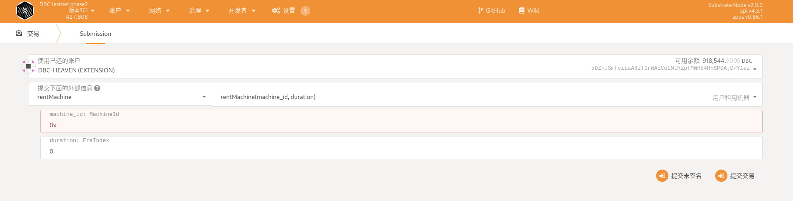
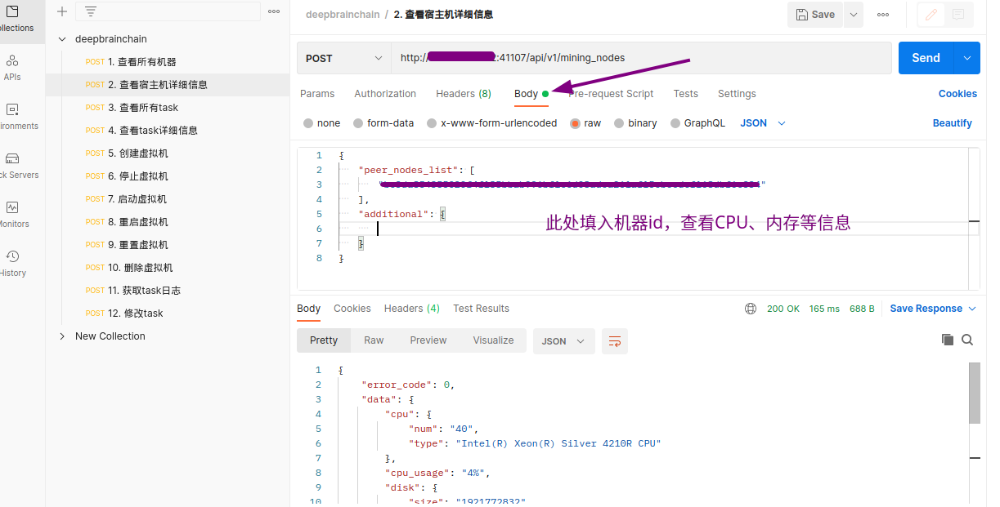

# 链上机器租用
## 租用流程

### 步骤一
+ 打开浏览器https://www.dbcwallet.io/?rpc=wss%3A%2F%2Finnertest.dbcwallet.io#/extrinsics
+ 添加类型：`设置`----`开发者`，导入以下json内容https://github.com/DeepBrainChain/DeepBrainChain-MainChain/blob/alpha-v2.0-fix/dbc_types.json

### 步骤二
+ 租用链上机器
+ 导航到`链状态`----`交易`----`rentMachine`----`rentMachine(machine_id, duration)`
  + machine_id输入要租用的机器id
  + duration输入需要租用的天数
  + 输入完成后点击提交交易，并在三十分钟内确认机器是否可用。

+ 确认机器可用并租赁
+ 导航到`链状态`----`交易`----`rentMachine`----`confirmRent(machine_id)`
  + 输入机器id并提交交易即可

+ 机器续租
+ 导航到`链状态`----`交易`----`rentMachine`----`reletMachine(machine_id, add_duration)`
  + 输入机器id以及续租天数，提交交易
### 创建虚拟机
+ post发送请求创建虚拟机
  + 导入json文件：`fiel`----`import`----`选择json文件导入`
  + 查看宿主机详细信息：
  
  + 创建虚拟机：选择创建虚拟机请求模块，`body`处填入：`peer_nodes_list`:机器id；`ssh_port`:定义ssh登录端口；`image_name`：填入ubuntu.qcow2即可，`GPU_count`：根据机器实际GPU数量填入；`CPU_cores`：选择提供给虚拟机的CPU内核数，（本操作属于宿主机CPU直通虚拟机，建议留给宿主机三个及以上保证机器稳定运行，否则导致整个机器卡死，无法正常使用）；`mem_rate`：填入1.0即可

+ 创建过程比较慢，大约在五分钟到十五分钟之间，成功发送请求后会返回值会有机器登录信息，请妥善保存。成功登录到虚拟机之后，确认没有问题请在规定时间内到链上确认租用信息
+ 其他虚拟机相关操作与正常操作相类似。
