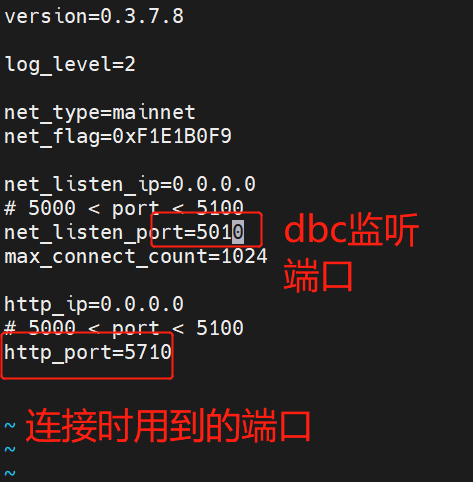

### 搭建客户端

-----

#### 搭建客户端

- 下载客户端：

- 参考： https://github.com/DeepBrainChain/DBC-AIComputingNet/releases/

- 下载 `install_client.sh` 

- 给sh脚本加执行权限：`chmod +x install_client.sh `

- 执行`./install_client.sh [文件名]`

- 配置`conf/core.conf`下端口（注：建议端口范围为5000~5100，图片仅供参考）：

  

- 注意：一台机器上只能安装一个功能节点(mining_node)，但是，客户端节点可以安装多个