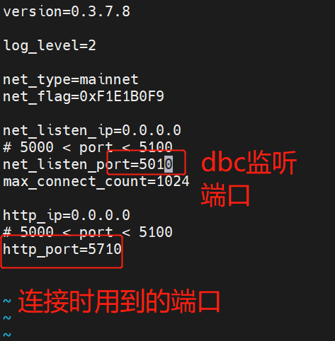

# 搭建客户端

- 下载客户端：

- 参考： https://github.com/DeepBrainChain/DBC-AIComputingNet/releases/

- 下载 `install_client.sh`

- 给 sh 脚本加执行权限：`chmod +x install_client.sh `

- 执行`./install_client.sh [文件名]`

- 在`conf/core.conf`配置端口（注：建议端口范围为 5000~5100，图片仅供参考）：

  
