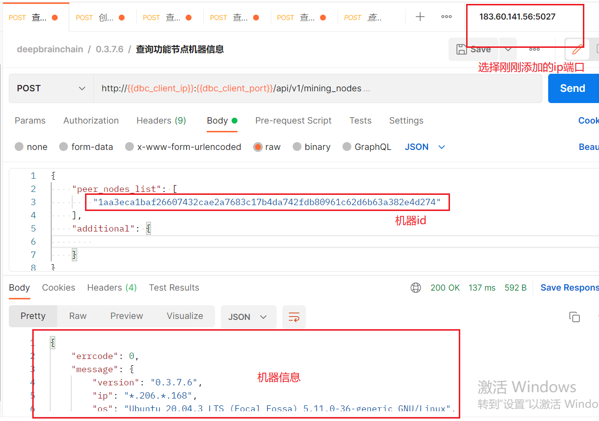
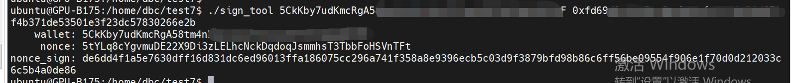
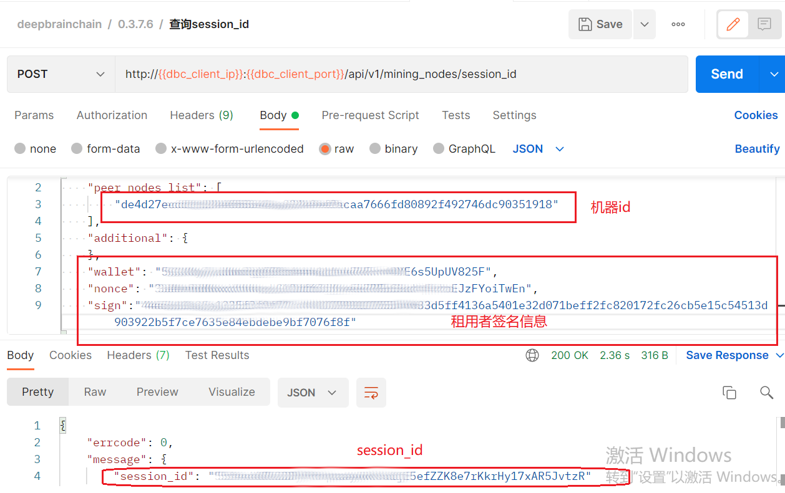
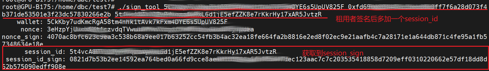
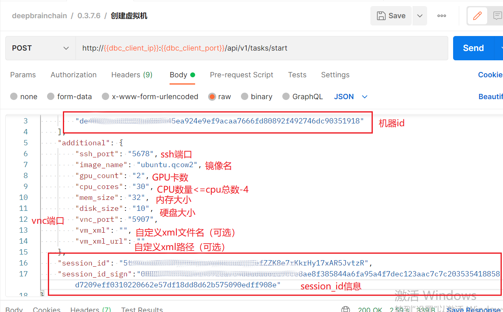
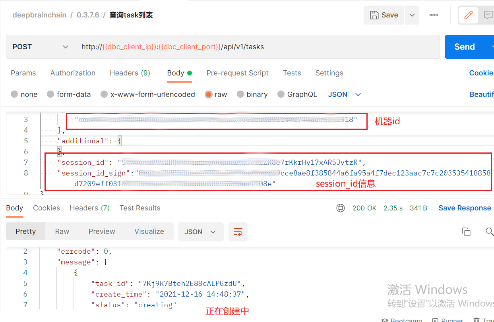
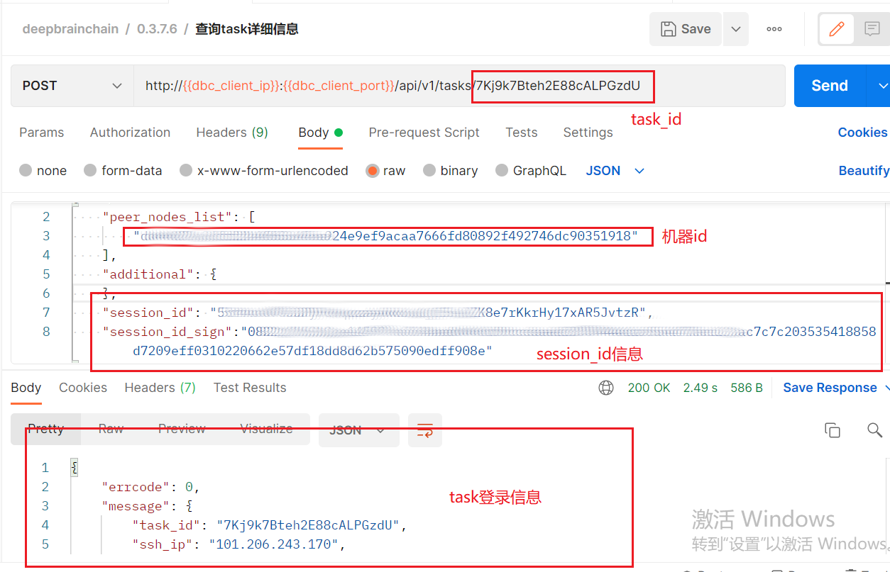
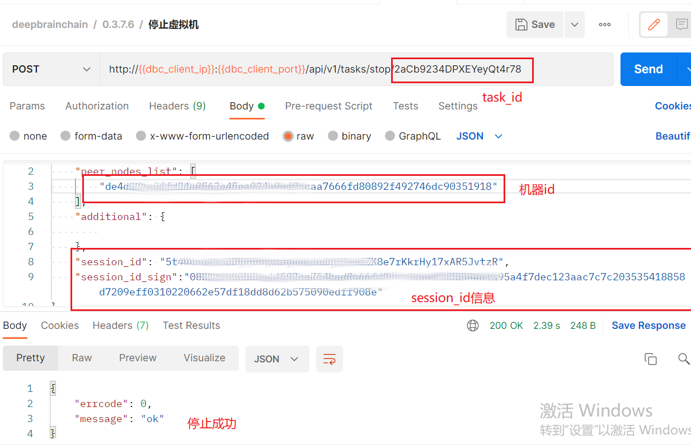
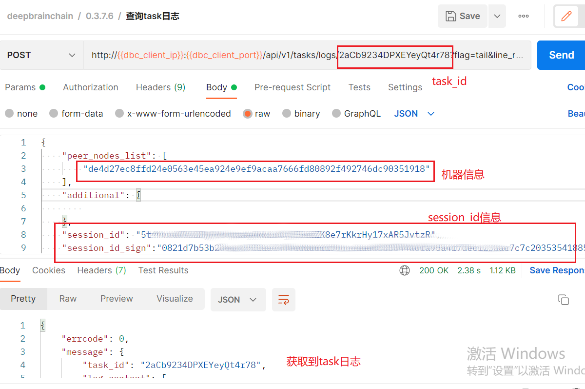

### 创建虚拟机

----

### 步骤一： 安装请求工具

* 下载安装postman，具体下载请去官网根据操作系统安装

* 下载json文件：http://121.57.95.175:20027/index.html/deepbrainchain.postman_collection.json

* 导入json文件：`fiel`----`import`----`选择json文件导入` 

* 利用postman发送创建请求
  添加客户端节点至环境变量：

  * 测试环境是否可用

    

#### 步骤二：搭建客户端

* 下载客户端：
* 参考： https://github.com/DeepBrainChain/DBC-AIComputingNet/releases/download/0.3.7.8/install_client.sh

* 注意：一台机器上只能安装一个功能节点(mining_node)，但是，客户端节点可以安装多个

  

#### 步骤三：创建虚拟机

* 生成签名信息
  * 在linux服务器下载签名工具：http://121.57.95.175:20027/index.html/sign_tool
  
  * linux服务器安装`libvirtd`
  
  * 执行`chmod +x sign_tool`添加可执行权限
  
  * 生成签名信息：`./sign_tool 钱包地址 钱包私钥`
    
  
    
  
  * 用生成的wallet、nonce、sign信息去请求获取session_id
  
    
  
    
  
  * 生成session_id签名：`./sign_tool 钱包地址 钱包私钥 上一步获取到的session_id`
    
  
  

  * 获取session_id及session_sign（注：租用者生成的session_id及sign可重复使用）

  * 创建虚拟机：选择创建虚拟机请求模块，`body`处填入：`peer_nodes_list`:机器id；`ssh_port`:定义ssh登录端口；`image_name`：要创建的虚拟机镜像名，`GPU_count`：根据机器实际GPU数量填入；`CPU_cores`：选择提供给虚拟机的CPU内核数（本操作属于宿主机CPU直通虚拟机，建议留给宿主机四个及以上CPU保证机器稳定运行，（虚拟机内核数最好为偶数），否则导致整个机器卡死，无法正常使用）；`mem_size`：填入内存大小（单位为G）;`disk_size`:填入硬盘大小（单位为G）;`vnc_port`:填入vnc的登录端口；`vm_xml`:自定义xml文件名称；`vm_xml_url`:自定义xml文件的路径

​    

  * 创建过程比较慢，大约在五分钟到十五分钟之间，在postman的查看task详细信息查看虚拟机登录信息及虚拟机状态，如返回的结果中"status": "creating"表示虚拟机正在创建，此时等待即可

  * 查看虚拟机具体登录信息

#### 虚拟机其他操作

* 停止虚拟机（启动，重启，重置，删除也是同等操作）

* 查看虚拟机的日志信息

