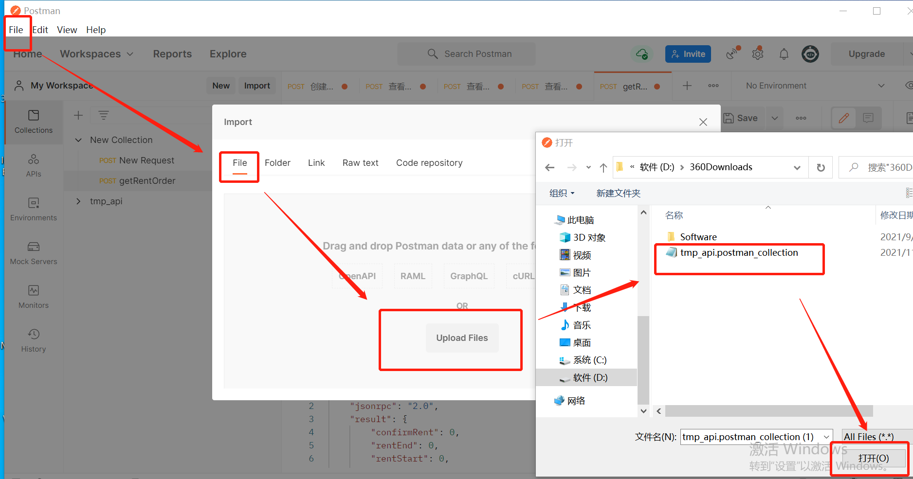
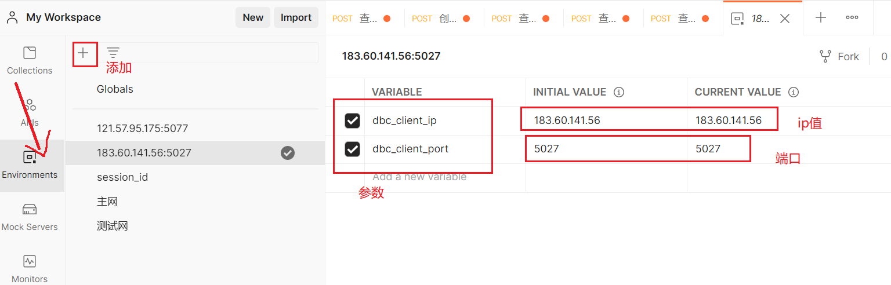
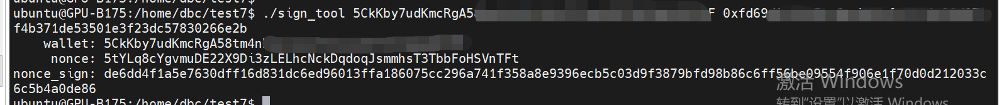
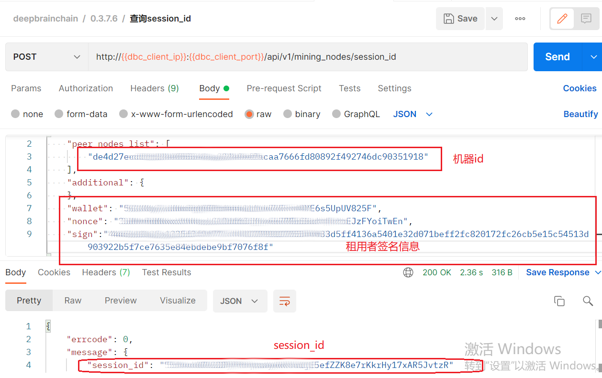
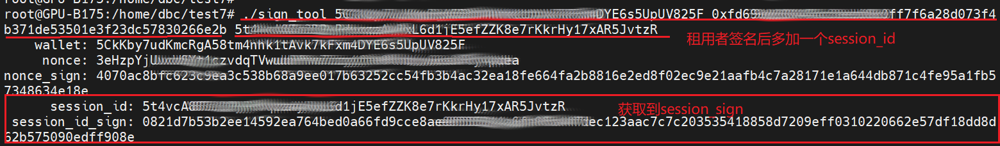
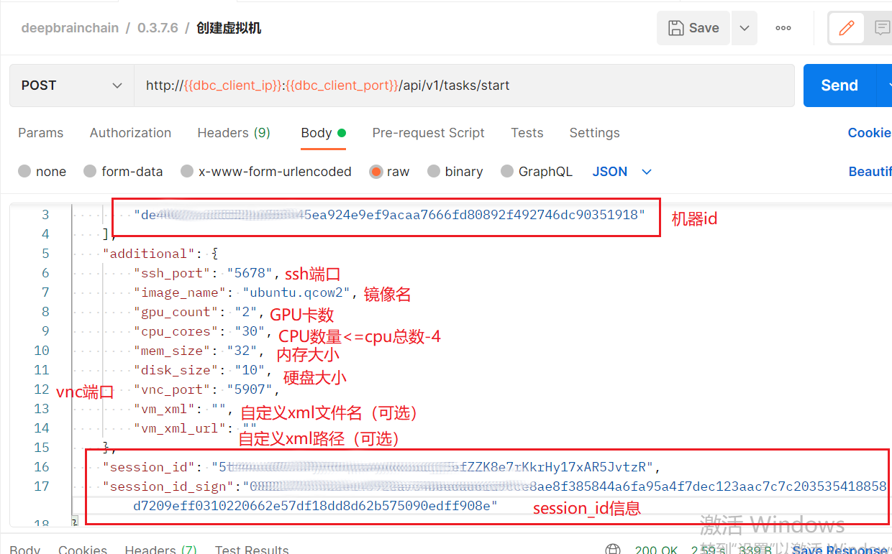
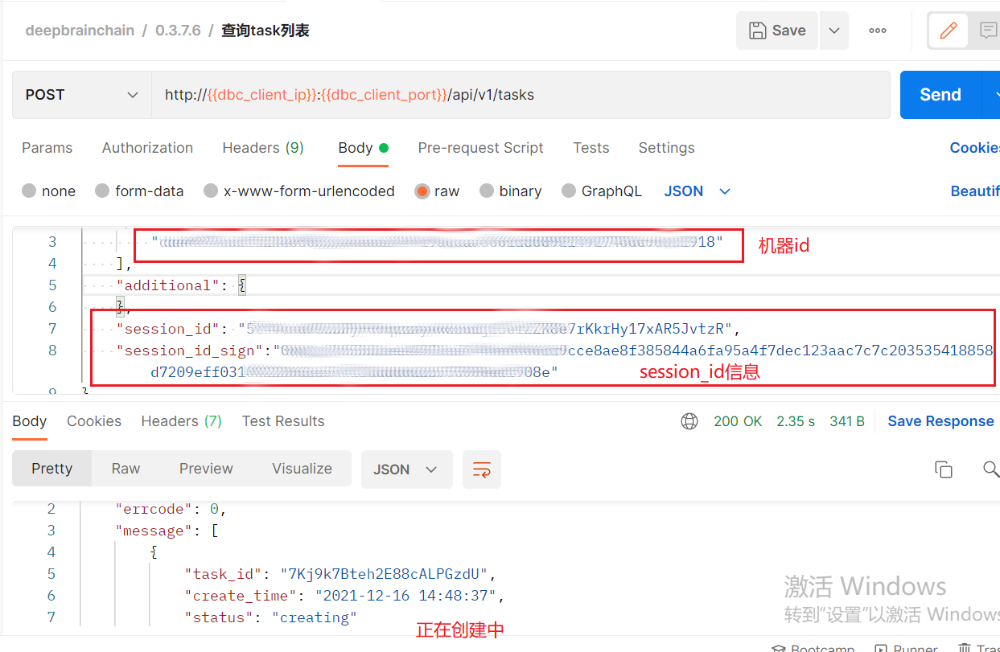
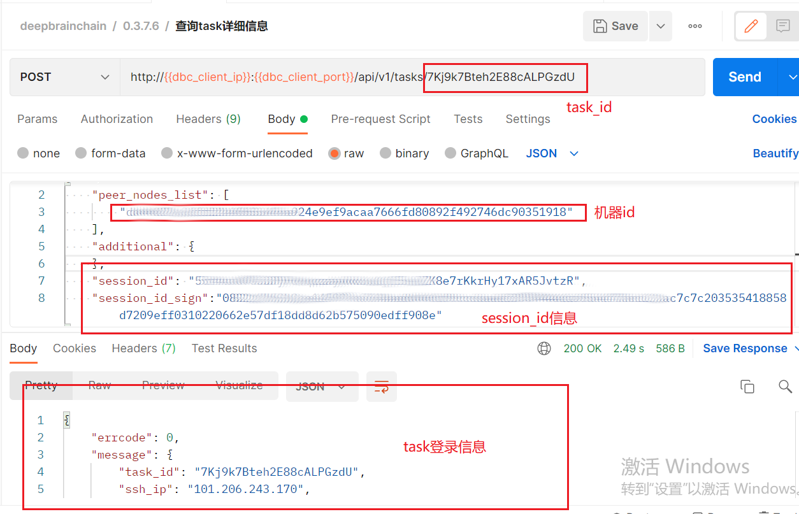
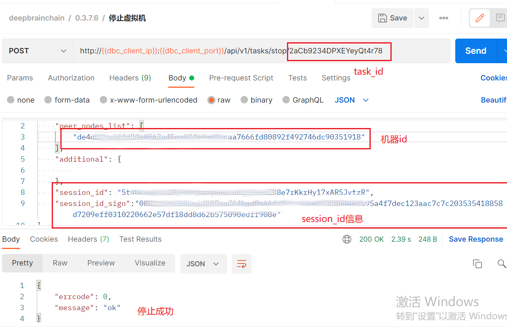

# 创建虚拟机

## 步骤一： 安装请求工具

- 下载安装 postman，具体下载请去官网根据操作系统安装

- 下载 json 文件：[http://36.102.233.175:20027/index.html/GPU%20API.postman_collection.json](http://116.169.53.132:9000/dbc/package/dbc_client-0.4.0.0.postman_collection.json)

- 导入 json 文件：`fiel`----`import`----`选择json文件导入`

- 利用 postman 发送创建请求，添加客户端节点至环境变量：

- 测试环境是否可用

## 步骤二：搭建客户端

- 搭建客户端参考文档：https://github.com/DeepBrainChain/DBC-DOC/blob/master/creat_macine/Build_client.md

## 步骤三：创建虚拟机

- 生成签名信息

  - 在 linux 服务器下载签名工具：[http://36.102.233.175:20027/index.html/sign_tool](http://116.169.53.132:9000/dbc/package/sign_tool)

  - linux 服务器安装`libvirtd`

  - 执行`chmod +x sign_tool`添加可执行权限

  - 生成签名信息：`./sign_tool 钱包地址 钱包私钥`
    

  - 用生成的 wallet、nonce、sign 信息去请求获取 session_id

    

  - 生成 session_id 签名：`./sign_tool 钱包地址 钱包私钥 上一步获取到的session_id`
    

  - 获取 session_id 及 session_sign（注：租用者生成的 session_id 及 sign 可重复使用）

- 创建虚拟机：选择创建虚拟机请求模块，`body`处填入：`peer_nodes_list`:机器 id；`ssh_port`:定义 ssh 登录端口；`image_name`：要创建的虚拟机镜像名，`GPU_count`：根据机器实际 GPU 数量填入；`CPU_cores`：选择提供给虚拟机的 CPU 内核数（本操作属于宿主机 CPU 直通虚拟机，建议留给宿主机四个及以上 CPU 保证机器稳定运行，（虚拟机内核数最好为偶数），否则导致整个机器卡死，无法正常使用）；`mem_size`：填入内存大小（单位为 G）;`disk_size`:填入硬盘大小（单位为 G）;`vnc_port`:填入 vnc 的登录端口；`vm_xml`:自定义 xml 文件名称；`vm_xml_url`:自定义 xml 文件的路径

​

- 创建过程比较慢，大约在五分钟到十五分钟之间，在 postman 的查看 task 详细信息查看虚拟机登录信息及虚拟机状态，如返回的结果中"status": "creating"表示虚拟机正在创建，此时等待即可

- 查看虚拟机具体登录信息

## 虚拟机其他操作

- 停止虚拟机（启动，重启，重置，删除也是同等操作）

- 查看虚拟机的日志信息

