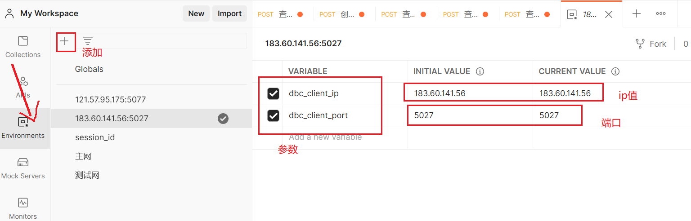
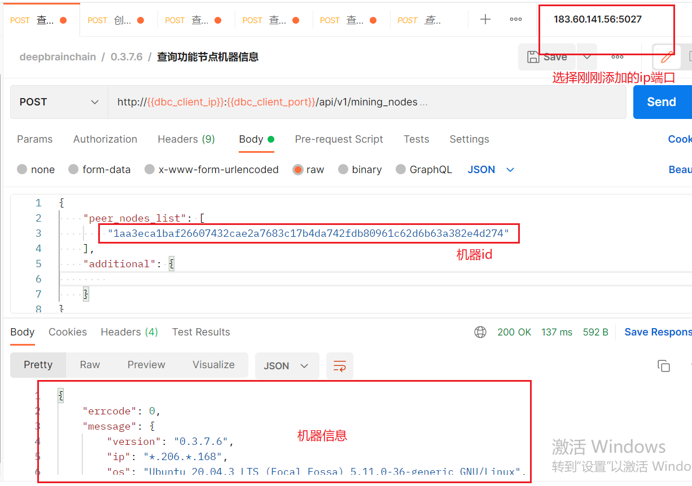
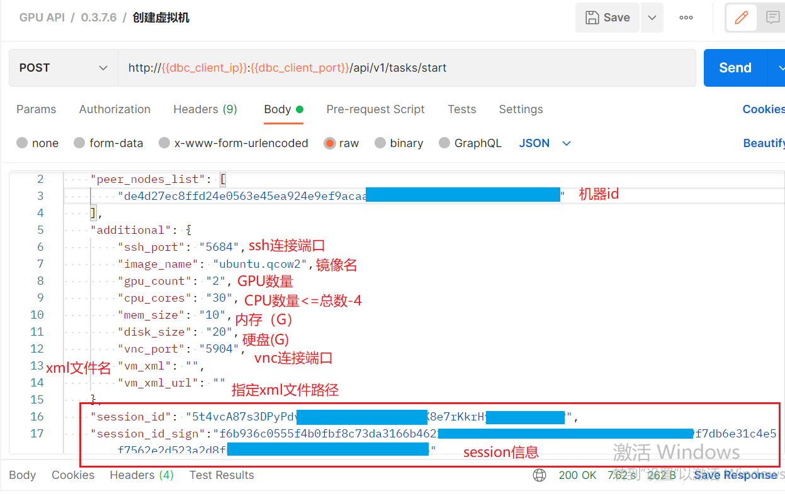
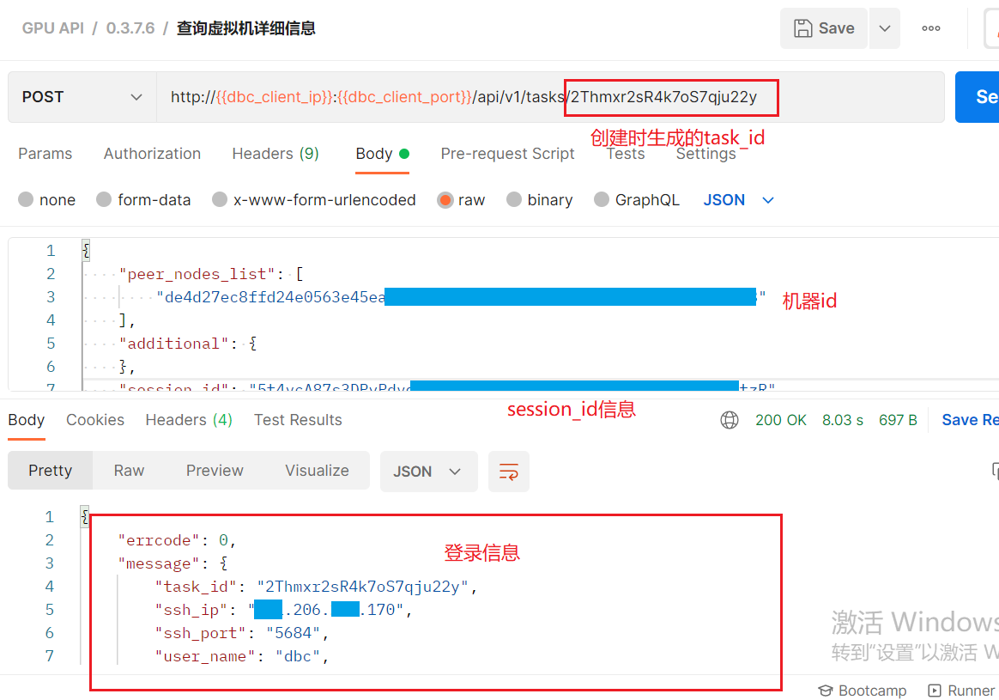
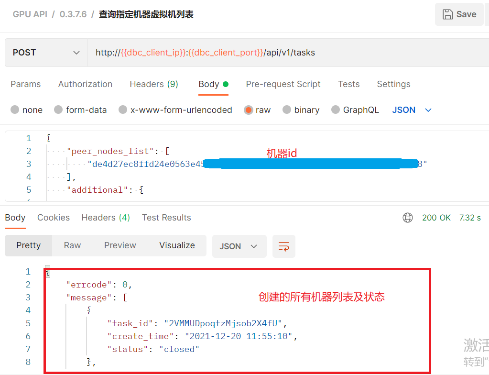
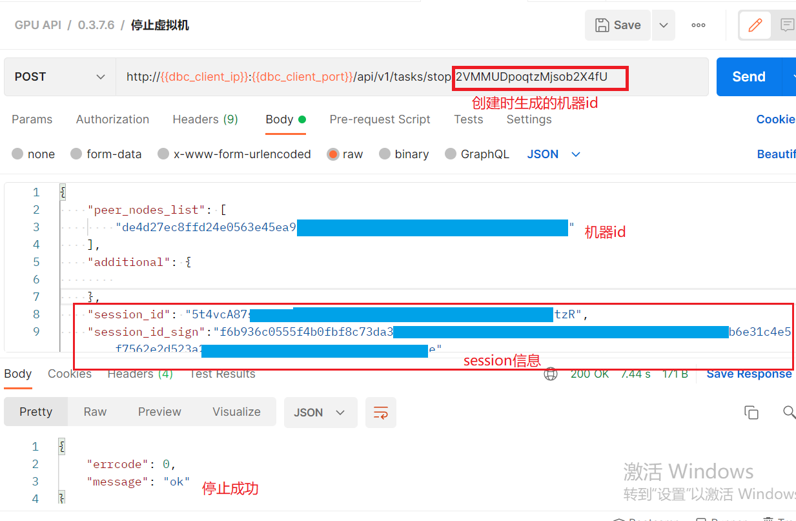

# 操作虚拟机

## 步骤一：安装请求工具

- 下载安装 postman，具体下载请去官网根据操作系统安装

- 下载 json 文件：http://36.102.233.175:20027/index.html/GPU%20API.postman_collection.json (提示：客户端节点也可以自己部署，自定义 ip 地址和端口号，也可以自己指定域名)

- 搭建客户端节点参考文档:https://github.com/DeepBrainChain/DBC-DOC/blob/master/creat_macine/Build_client.md

- 导入 json 文件：`fiel`----`import`----`选择json文件导入`

  

- 利用 postman 发送创建请求 添加客户端节点至环境变量：

  

- 测试环境是否可用

  

## 步骤二：操作虚拟机

- 创建虚拟机：选择创建虚拟机请求模块，`body`处填入：`peer_nodes_list`:机器 id；`ssh_port`:定义 ssh 登录端口(每个虚拟机需不同值)；`image_name`：要创建的虚拟机镜像名，`GPU_count`：根据机器实际 GPU 数量填入；`CPU_cores`：选择提供给虚拟机的 CPU 内核数（本操作属于宿主机 CPU 直通虚拟机，建议留给宿主机四个及以上 CPU 保证机器稳定运行，（虚拟机内核数最好为偶数），否则导致整个机器卡死，无法正常使用）；`mem_size`：填入内存大小（单位为 G）;`disk_size`:填入硬盘大小（单位为 G）;`vnc_port`:填入 vnc 的登录端口；`vm_xml`:自定义 xml 文件名称(可选)；`vm_xml_url`:自定义 xml 文件的路径(可选)

  

- 创建过程比较慢，大约在五分钟到十五分钟之间，在 postman 的查询虚拟机详细信息即可查看虚拟机状态及详细的登录信息，如返回的结果中"status": "creating"表示虚拟机正在创建（running 表示创建成功），此时等待即可

  

- 查询指定机器创建过的虚拟机列表及虚拟机状态

  

- 停止虚拟机（启动虚拟机，重启虚拟机，重置虚拟机，删除虚拟机也是同样操作）

  
