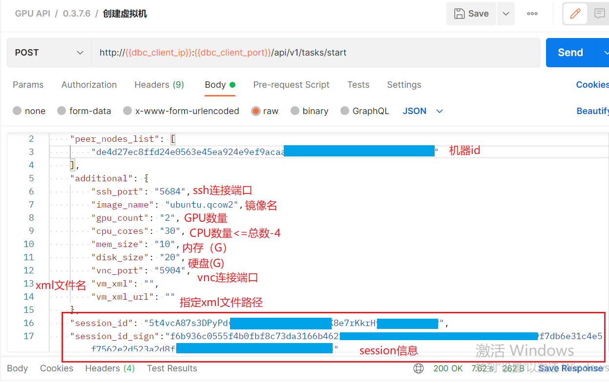
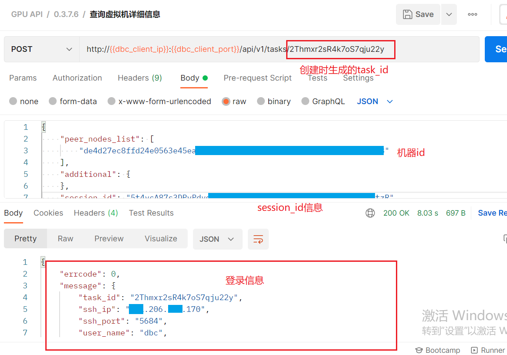
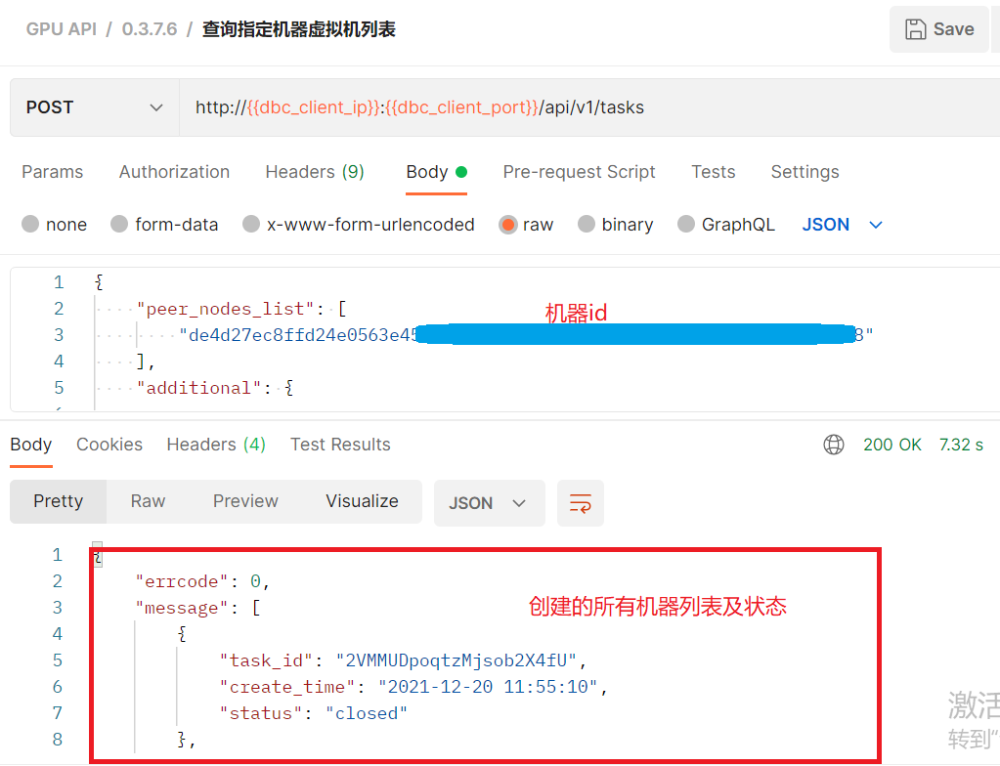
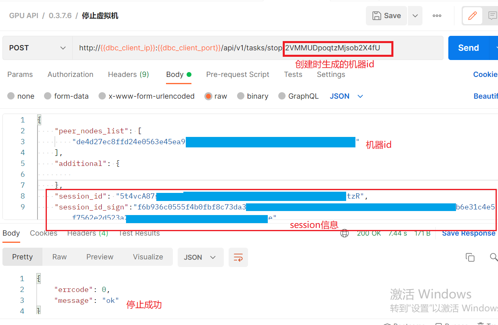

### 操作虚拟机

----

#### 步骤一：安装请求工具

- 下载安装postman，具体下载请去官网根据操作系统安装

- 下载json文件：http://121.57.95.175:20027/index.html/deepbrainchain.postman_collection.json

- 导入json文件：`fiel`----`import`----`选择json文件导入`

  
  

- 利用postman发送创建请求 添加客户端节点至环境变量：

  

- 测试环境是否可用

  

#### 步骤二：操作虚拟机

- 创建虚拟机：选择创建虚拟机请求模块，`body`处填入：`peer_nodes_list`:机器id；`ssh_port`:定义ssh登录端口；`image_name`：要创建的虚拟机镜像名，`GPU_count`：根据机器实际GPU数量填入；`CPU_cores`：选择提供给虚拟机的CPU内核数（本操作属于宿主机CPU直通虚拟机，建议留给宿主机四个及以上CPU保证机器稳定运行，（虚拟机内核数最好为偶数），否则导致整个机器卡死，无法正常使用）；`mem_size`：填入内存大小（单位为G）;`disk_size`:填入硬盘大小（单位为G）;`vnc_port`:填入vnc的登录端口；`vm_xml`:自定义xml文件名称；`vm_xml_url`:自定义xml文件的路径

  

- 创建过程比较慢，大约在五分钟到十五分钟之间，在postman的查询虚拟机详细信息即可查看虚拟机状态及详细的登录信息，如返回的结果中"status": "creating"表示虚拟机正在创建（running表示创建成功），此时等待即可

  

- 查询指定机器创建过的虚拟机列表及虚拟机状态

  

- 停止虚拟机（启动虚拟机，重启虚拟机，重置虚拟机，删除虚拟机也是同样操作）

  

