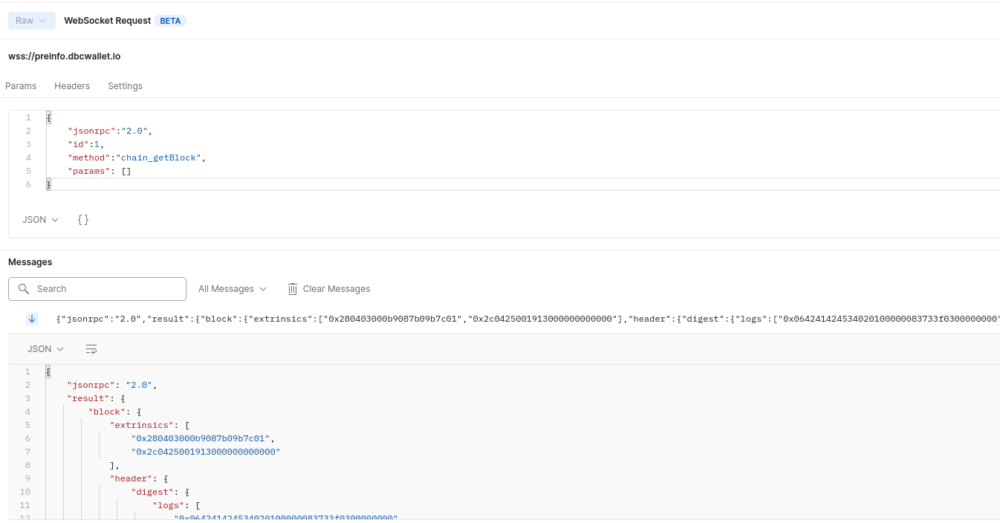
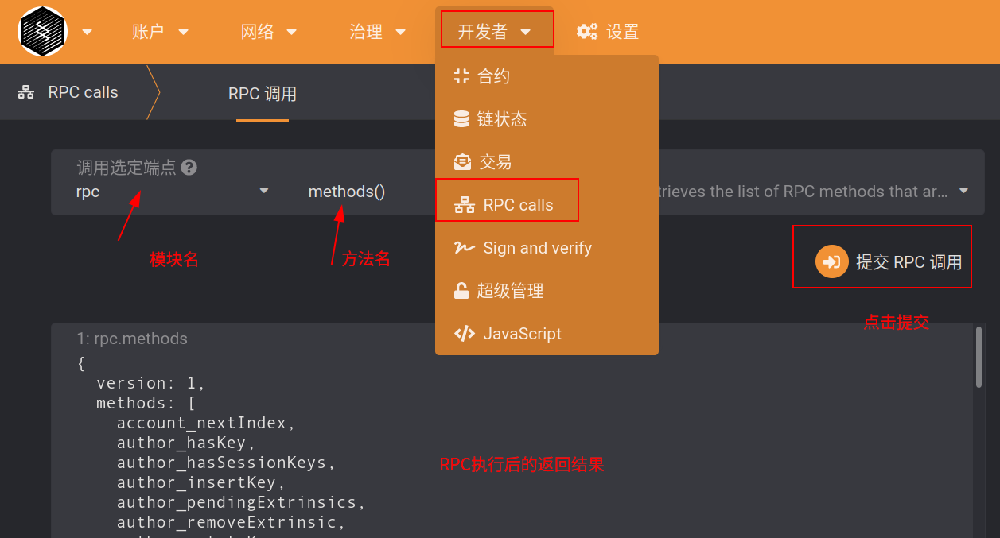

# DBC-Blockchain 主网 RPC

目录

- [DBC-Blockchain 主网 RPC](#dbc-blockchain-主网-rpc)
  - [RPC 说明](#rpc-说明)
  - [如何搭建自己的 RPC 节点](#如何搭建自己的-rpc-节点)
  - [**关于`块高`，奖励发放时间，与`Era`的说明**：](#关于块高奖励发放时间与era的说明)
    - [获取当前块高](#获取当前块高)
    - [Era 与奖励发放时间](#era-与奖励发放时间)
  - [DBC Custom RPC](#dbc-custom-rpc)
    - [1. 查询某个资金账户控制的所有机器:](#1-查询某个资金账户控制的所有机器)
    - [2. 查询机器某个 Era 获得收益： `onlineProfile_getMachineEraReward`](#2-查询机器某个-era-获得收益-onlineprofile_getmachineerareward)
    - [3. 查询机器某个 Era 解锁收益](#3-查询机器某个-era-解锁收益)
    - [4. 查询资金账户某个 Era 获得收益](#4-查询资金账户某个-era-获得收益)
    - [5. 查询资金账户某个 Era 解锁奖励](#5-查询资金账户某个-era-解锁奖励)
    - [6. 查询机器详细信息](#6-查询机器详细信息)
    - [7. 查询链上历史币价](#7-查询链上历史币价)

## RPC 说明

**说明 1：** 文档适用 dbc 主网，当前分支[`master`](https://github.com/DeepBrainChain/DeepBrainChain-MainChain)，websocket 接口地址： `wss://info.dbcwallet.io`

**说明 2** 除了使用官方`websocket接口`，还可以自己搭建同步节点使用自己的节点提供的`HTTP接口`获取数据。同步节点搭建方式请查看[如何搭建自己的 API 节点](https://github.com/DeepBrainChain/DeepBrainChain-MainChain/blob/master/docs/Run_archive_node.md)，使用 HTTP 接口获取数据的例子，可以查看本文件夹下的`dbc_chain_rpc.postman_collection.json`，导入 Postman 进行查看。

**说明 3：** 请求方式：

```json
{
  "jsonrpc": "2.0",
  "id": 1,
  "method": method_name,
  "params": [params_1, params_2...]
}
```

其中，`method_name` 为 RPC 方法名，params_1, params_2... 根据需要替换成需要的参数。

例如，利用 Postman 连接 websocket 查询`区块信息`：

> Postman 创建 websocket API 的方法：https://blog.postman.com/postman-supports-websocket-apis/
>
> 

**说明 4：** 本文档仅包含 **`自定义RPC的说明`** ，如果想查看 **`基于波卡链原生RPC的文档说明`** ，可以参考: https://polkadot.js.org/docs/substrate/rpc/；

**说明 5:** 查看所有 RPC 的方法：可到 dbc 网页钱包：https://www.dbcwallet.io/ ，点击左侧切换网络，在自定义终端中，输入 websocket 地址。然后如下图导航到 `RPC calls`，查看区块链支持的所有 RPC。如图，选择 `rpc`模块的`methods`方法，点击右边的`提交RPC调用`，将列出所有的 RPC 方法名。



## 如何搭建自己的 RPC 节点

可以自己搭建同步节点，通过自己的节点节点获取链上数据。方法：

```bash
# 配置Rust编译环境
curl https://getsubstrate.io -sSf | bash -s -- --fast
source ~/.cargo/env

# 编译dbc-chain
git clone https://github.com/DeepBrainChain/DeepBrainChain-MainChain.git && cd DeepBrainChain-MainChain
cargo build --release

# 运行同步节点：
./target/release/dbc-chain --base-path ./db_data --chain ./dbcSpecRaw.json --pruning archive --rpc-cors all --no-mdns --bootnodes /ip4/111.44.254.180/tcp/20337/p2p/12D3KooWNtUXjdy8Q9hvdJ35a1jWpPnVBRgpT7nP8LmEgBWGqTpm

# 重要参数：
--rpc-port 9933   # 指定你的节点监听RPC的端口。 9933 是默认值，因此该参数也可忽略
--ws-port 9945    # 指定你的节点用于监听 WebSocket 的端口。 默认端口为 9944
--port 30333      # 指定你用于监听 p2p 流量的节点端口。 30333 是默认端口，若无需更改，可以忽略该 flag
```

如上方法运行了同步节点之后，可以通过 `ws://127.0.0.1:9945` 调用 websocket 接口，通过`http://127.0.0.1:9933` 调用 http 接口。

如果想远程访问，需要为 websocket 或 http 配置域名，以支持 `wss` 或者 `https`

## **关于`块高`，奖励发放时间，与`Era`的说明**：

#### 获取当前块高

- 方法： `chain_getBlock`

- 调用方法：

  ```json
  {
    "jsonrpc": "2.0",
    "id": 1,
    "method": "chain_getBlock",
    "params": []
  }
  ```

- 返回结果：

  ```json
  {
      "jsonrpc": "2.0",
      "result": {
          "block": {
        ...
              "header": {
        ...
                  "number": "0x2d8",
                  "parentHash": "0xc0e1b239fafc0edf3e08a908b5caecb27c2b351ed0daef3fc60c5600b28d6d7d",
                  "stateRoot": "0x55ce4794b2cdd21275656a80febf5133d882d909a2de6d40d7b8887bd65628bc"
              }
          },
          "justification": null
      },
      "id": 1
  }
  ```

  其中，"number": "0x2d8" 即为块高，转为十进制为：728

#### Era 与奖励发放时间

- 1 Era 为 2880 个区块高度，在 DBC 区块链上，约是 1 天。发放奖励的时间，为区块链高度的 `[2880*n, 2880*n+60]` 的时间区间。

- 在第 n Era 上线的机器，在 n+1 Era 结束时发放。即如果在 Era2 上线的机器即 [5761, 8640]，奖励将会在 Era4 开始前 60 个块的区间内发放 Era3 的奖励，即在 `2880*4=11520` 时开始发放。可以在之后查到 Era3 的奖励，如通过 erasMachineReleasedReward 方法，查到 era3 机器获得的奖励。
- 当前主网上，[529920, 532800] 为 Era1， [532801, 535680] 为 Era2...

## DBC Custom RPC

#### 1. 查询某个资金账户控制的所有机器:

#### 2. 查询机器某个 Era 获得收益： `onlineProfile_getMachineEraReward`

- 示例：

  ```json
  {
    "jsonrpc": "2.0",
    "id": 1,
    "method": "onlineProfile_getMachineEraReward",
    "params": [
      "ee0d003006f8ddbccb97dff96bcb4bee1b8c1aeaf7c64e0ca9d0f31752d17875",
      1
    ]
  }
  ```

  其中，参数分别为`MachineId`， `Era`

- 结果：

  ```json
  {
    "jsonrpc": "2.0",
    "result": "123456",
    "id": 1
  }
  ```

#### 3. 查询机器某个 Era 解锁收益

- 方法：`onlineProfile_getMachineEraReleasedReward`

- 示例：

  ```json
  {
    "jsonrpc": "2.0",
    "id": 1,
    "method": "onlineProfile_getMachineEraReleasedReward",
    "params": [
      "ee0d003006f8ddbccb97dff96bcb4bee1b8c1aeaf7c64e0ca9d0f31752d17875",
      1
    ]
  }
  ```

  其中，参数分别为`MachineId`， `Era`

- 结果：

  ```json
  {
    "jsonrpc": "2.0",
    "result": "123456",
    "id": 1
  }
  ```

#### 4. 查询资金账户某个 Era 获得收益

- `onlineProfile_getStashEraReward`

- 示例：

  ```json
  {
    "jsonrpc": "2.0",
    "id": 1,
    "method": "onlineProfile_getStashEraReward",
    "params": ["5DhR2dxiPZquPhFjfPzFg5jZENdr375hbX643kr9FBXMVa2z", 1]
  }
  ```

  其中，参数分别为 `资金账户`，`Era`

- 结果：

  ```json
  {
    "jsonrpc": "2.0",
    "result": "123456",
    "id": 1
  }
  ```

#### 5. 查询资金账户某个 Era 解锁奖励

- `onlineProfile_getStashEraReleasedReward`

- 示例：

  ```json
  {
    "jsonrpc": "2.0",
    "id": 1,
    "method": "onlineProfile_getStashEraReward",
    "params": ["5DhR2dxiPZquPhFjfPzFg5jZENdr375hbX643kr9FBXMVa2z", 1]
  }
  ```

  其中，参数分别为 `资金账户`，`Era`

- 结果：

  ```json
  {
    "jsonrpc": "2.0",
    "result": "123456",
    "id": 1
  }
  ```

#### 6. 查询机器详细信息

#### 7. 查询链上历史币价

TODO:

<details>
  <summary>committee_getCommitteeList</summary>

说明：

例子:

```json

```

</details>

```bash
committee_getCommitteeList

onilneCommittee_getCommitteeMachineList
onlineCommittee_getCommitteeOps
onlineCommittee_getMachineCommitteeList

onlineProfile_getStashEraReward
onlineProfile_getStashEraReleasedReward
onlineProfile_getMachineEraReward
onlineProfile_getMachineEraReleasedReward

onlineProfile_getMachineInfo
onlineProfile_getMachineList
onlineProfile_getOpInfo
onlineProfile_getPosGpuInfo
onlineProfile_getStakerIdentity
onlineProfile_getStakerInfo
onlineProfile_getStakerListInfo
onlineProfile_getStakerNum

rentMachine_getRentList
rentMachine_getRentOrder
```
