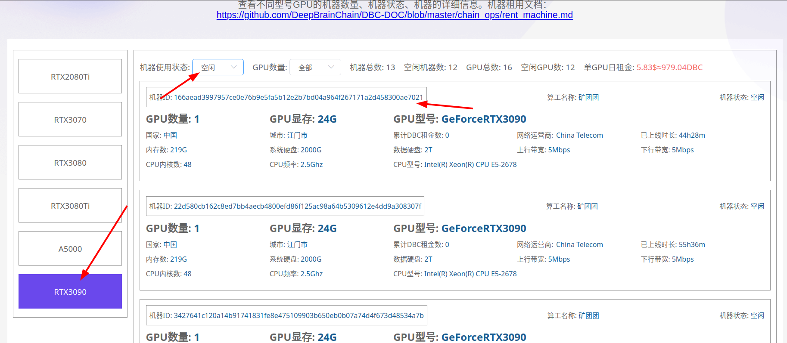
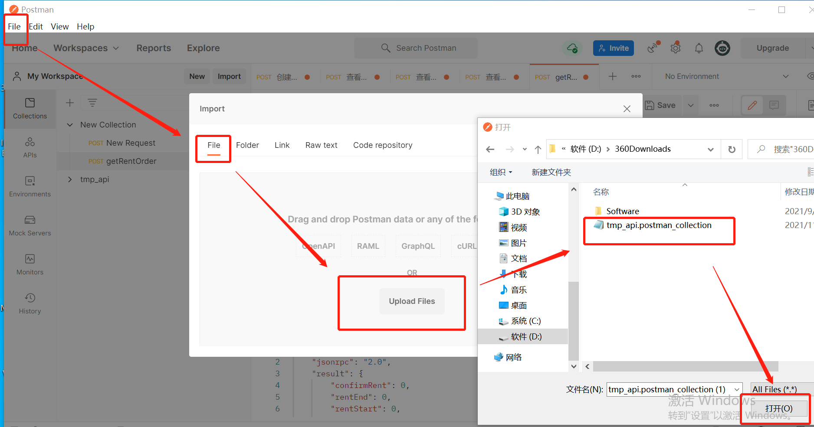

## 链上机器租用 

### 租用流程 

***

> note: 图片中部分配置仅作参考

#### 步骤一

* 打开浏览器 https://www.dbcwallet.io/?rpc=wss%3A%2F%2Finfo.dbcwallet.io（打开会提示报错，这个是正常现象，这个时候根据下面步骤来继续操作）

* 添加类型：`设置`----`开发者`，复制粘贴以下json内容https://github.com/DeepBrainChain/DeepBrainChain-MainChain/blob/alpha-v2.1/dbc_types.json

* 创建钱包：账户-->添加账户 （助记词一定要保存好，丢失了助记词，账户就无法找回，币就丢失掉了）

* 到https://galaxyrace.deepbrainchain.org/table 找到对应类型的空闲机器

  

#### 步骤二 

* 租用链上机器 
     - 导航到 `开发者`---`交易`---`rentMachine` ----`rentMachine(machine_id, duration)`
     - machine_id输入要租用的机器id，输入框里面的`0x`要先删除掉
     - duration输入需要租用的天数
     - 输入完成后点击提交交易，并在三十分钟内确认机器是否可用。（如果30分钟内不确认租用，支付的`dbc`会退回，但是交易手续费10 `dbc`是无法退回的）

#### 步骤三：搭建客户端节点

* 下载客户端节点压缩包地址：http://111.44.254.179:22244/dbc/dbc_client_node_0.3.7.4.tar.gz

* 解压安装包

* 修改解压出的文件中`conf/core.conf`配置文件中的2个端口号(不要和其它节点相冲突即可,建议端口范围：5000 ~ 5100)

  

* 注意：一台机器上只能安装一个功能节点(mining_node)，但是，客户端节点可以安装多个

#### 步骤四：创建虚拟机 

* 生成签名信息

  - 在linux服务器下载签名工具http://111.44.254.179:22244/sign_tool
  - linux服务器安装libvirtd
  - 执行`chmod +x sign_tool`添加可执行权限
  - 生成签名信息：`./sign_tool 钱包地址 钱包私钥`
  - 将生成的签名信息对应填入`sign`,`nonce`,`wallet`即可

* post发送请求创建虚拟机

  - 下载安装postman，具体下载请去官网根据操作系统安装
  - 下载json文件：http://111.44.254.179:22244/tmp_api.postman_collection.json
  - 导入json文件：`fiel`----`import`----`选择json文件导入` 

  

  - 查看宿主机详细信息

    

  - 创建虚拟机：选择创建虚拟机请求模块，`body`处填入：`peer_nodes_list`:机器id；`ssh_port`:定义ssh登录端口；`image_name`：填入ubuntu.qcow2即可，`GPU_count`：根据机器实际GPU数量填入；`CPU_cores`：选择提供给虚拟机的CPU内核数，（本操作属于宿主机CPU直通虚拟机，建议留给宿主机四个及以上保证机器稳定运行，（虚拟机内核数最好为偶数），否则导致整个机器卡死，无法正常使用）；`mem_rate`：填入0.9即可

    

* 创建过程比较慢，大约在五分钟到十五分钟之间，在postman的查看task详细信息查看虚拟机登录信息,创建完成后请及时到链上确认租用（从付款起只有三十分钟）

  

* 虚拟机状态查看，查看task详细信息，返回的结果中"status": "creating"表示虚拟机正在创建，此时等待即可

* 其他虚拟机相关操作与上述操作相类似，请结合实际使用。

#### 步骤五：确认可用并租赁 （确认之前必须要确认虚拟机能够正常启动，否则这一步确认过后，表示机器租用成功，DBC是无法退回的）

* 导航到`开发者`----`交易`----`rentMachine`----`confirmRent(machine_id)`
* 输入机器id并提交交易即可

#### 机器续租 （机器到期会自动停止虚拟机，确保在到期之前续租成功）

* 导航到`开发者`----`交易`----`rentMachine`----`reletMachine(machine_id, add_duration)`
* 输入机器id以及续租天数，提交交易

